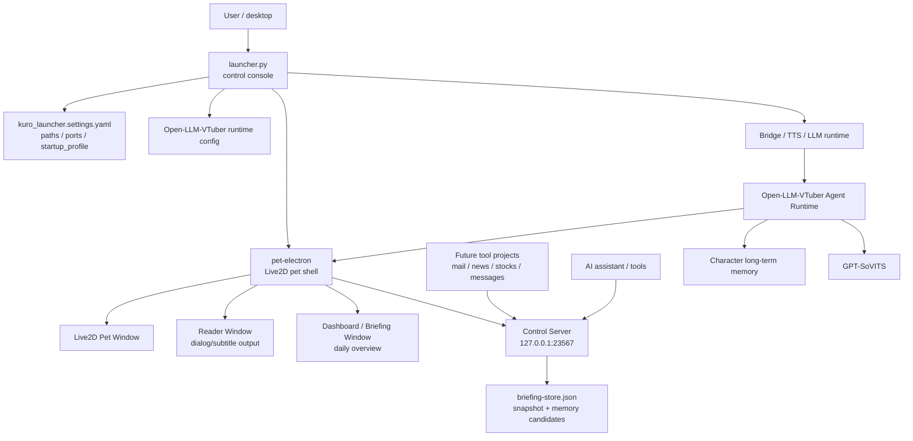

# Kuro Desktop Agent Runtime

Kuro 是一個 local-first 的桌面 AI 角色助理 runtime。這個 repository 把角色啟動器、Open-LLM-VTuber 後端、GPT-SoVITS 語音、Live2D 桌寵殼、角色記憶、專案 prompt、工具政策與桌面 Dashboard 串在同一個可控工作區中。

目前定位不是單純桌寵展示，而是「桌面個人助理的 runtime workspace」：

- 開機後可以依 `startup_profile` 預設啟動指定角色、專案與服裝。
- 角色可以透過 Live2D/Electron shell 常駐桌面。
- Launcher 負責啟停、設定、角色/專案/聊天/記憶管理。
- Dashboard / Briefing Panel 是 AI 和工具輸出的資料展示區。
- 長期記憶與今日簡報資料分離，避免即時資訊污染角色記憶。

> Current status: source-controlled runtime workspace. Local secrets, model weights, voice references, generated runtime config, logs, chat history, memory data, Electron userData, build output and dependency folders are intentionally excluded from git.

## Table of Contents

- [Current Milestone](#current-milestone)
- [Architecture](#architecture)
- [Repository Layout](#repository-layout)
- [Quick Start](#quick-start)
- [Configuration](#configuration)
- [Startup Profile](#startup-profile)
- [Launcher](#launcher)
- [Electron Pet Shell](#electron-pet-shell)
- [Dashboard / Briefing Panel](#dashboard--briefing-panel)
- [Memory Model](#memory-model)
- [Tool Integration Direction](#tool-integration-direction)
- [Runtime Ports](#runtime-ports)
- [Validation](#validation)
- [Git Hygiene](#git-hygiene)
- [GitHub Metadata](#github-metadata)

## Current Milestone

This branch currently includes the first integrated desktop assistant layer:

- `startup_profile` config for default character/project/outfit startup.
- Default startup target: `kuro` / `desktop-agent-runtime` / `hoodie`.
- Optional startup auto-start from launcher.
- Unified Windows AppUserModelID: `kuro.desktop-agent`.
- Electron `Reader` window for subtitle/dialog output.
- Electron `Briefing` window for persistent dashboard output.
- Launcher `Dashboard` toggle between `對話框` and `Game mode`.
- Briefing backend store with snapshot + memory-candidate separation.
- Control server APIs for dashboard data updates.

## Architecture



The important boundary is:

- Launcher config and UI decide what to start.
- Open-LLM-VTuber handles conversation, prompt composition, tools and memory.
- Electron handles desktop windows, taskbar identity, control server and Dashboard display.
- Tool projects should remain separate projects and push structured results into Kuro through explicit APIs.

## Repository Layout

| Path | Responsibility |
| --- | --- |
| `launcher.py` | Main launcher UI, startup profile application, service orchestration and pet shell controls. |
| `kuro_launcher/` | Launcher config parsing, service helpers, runtime config generation, memory panel and records. |
| `kuro_launcher.settings.yaml` | Main local runtime source of truth for paths, ports, LLM env names and startup profile. |
| `Open-LLM-VTuber/` | Agent runtime, WebSocket protocol, character configs, prompt/runtime logic and memory system. |
| `pet-electron/` | Electron shell, Live2D renderer, Reader window, Dashboard window and local control server. |
| `pet-electron/src/main-process/briefing-store.js` | Dashboard backend store for daily snapshot and memory candidates. |
| `bridges/` | Bridge service helpers, including translation/spoken-rendering integration. |
| `gpt_sovits/` | GPT-SoVITS runtime and TTS configuration. |
| `projects/` | Project prompt packs and assistant context definitions. |
| `voices/` | Local voice references and generated voice assets. Keep private data out of git. |
| `launcher_logs/` | Local launcher logs. Do not commit. |
| `envs/` | Local Python environments. Do not commit. |

## Quick Start

From the repo root:

```powershell
cd C:\project\kuro
.\envs\kuro-llm310\python.exe .\launcher.py
```

The VBS launcher can also be used from Explorer:

```text
桌寵啟動器.vbs
```

The VBS launcher prefers the repo-local Python executable:

```text
envs\kuro-llm310\python.exe
```

and falls back to `py .\launcher.py` if the repo-local runtime does not exist.

## Configuration

The main configuration file is:

```text
kuro_launcher.settings.yaml
```

Key sections:

```yaml
paths:
  ROOT: "${HERE}"
  open_llm_vtuber_dir: "${ROOT}\\Open-LLM-VTuber"
  projects_dir: "${ROOT}\\projects"
  pet_electron_dir: "${ROOT}\\pet-electron"
  runtime_conf_path: "${open_llm_vtuber_dir}\\conf.launcher_runtime.yaml"

network:
  bridge:
    host: "127.0.0.1"
    port: 1188
  tts:
    host: "127.0.0.1"
    port: 9981
  llm:
    host: "127.0.0.1"
    port: 23456
  pet_control:
    host: "127.0.0.1"
    port: 23567
```

Secrets must stay in local environment files or OS environment variables, not in tracked files:

```powershell
Copy-Item .env.example .env
notepad .env
```

Common LLM variables:

| Variable | Purpose |
| --- | --- |
| `KURO_LLM_PROVIDER` | Runtime LLM provider selector. |
| `OPENAI_LLM_API_KEY` | OpenAI-compatible LLM API key. |
| `OPENAI_API_KEY` | Fallback key used by some compatible integrations. |
| `OPENAI_LLM_MODEL` | Default OpenAI-compatible LLM model. |
| `OPENAI_LLM_TEMPERATURE` | Optional temperature override. |
| `OPENAI_TRANSLATE_MODEL` | Bridge / spoken rendering model. |
| `ENABLE_OLLAMA_FALLBACK` | Enables local Ollama fallback when configured. |
| `OLLAMA_BASE_URL` | Ollama-compatible endpoint. |

## Startup Profile

`startup_profile` defines what should be selected when launcher starts:

```yaml
startup_profile:
  character: "kuro"
  project: "desktop-agent-runtime"
  outfit: "hoodie"
  auto_start: true
```

Behavior:

- `character` matches character file stem, file name, `conf_name`, `conf_uid` or Live2D model name.
- `project` matches project id, display name or project folder.
- `outfit` currently normalizes values such as `hoodie`, `hood`, `帽T` to the hoodie state.
- `auto_start: true` schedules a one-time startup call to `on_start_profile()` after launcher UI selection settles.

If a configured item cannot be found, launcher logs the missing startup item and continues with available defaults.

## Launcher

Launcher is the operator console. It handles:

- Start/stop profile.
- Start/stop Bridge, TTS and LLM runtime.
- Launch Electron pet shell.
- Character, outfit, project and chat selection.
- Memory panel CRUD and approval controls.
- Pet shell status polling.
- Pet controls:
  - microphone
  - camera
  - screen
  - dialog / Reader window
  - Dashboard / Briefing window
  - Game mode
  - expression
  - thinking power

The launcher and Electron shell share the same Windows AppUserModelID:

```text
kuro.desktop-agent
```

This is intended to group the launcher and pet/Dashboard windows together on the Windows taskbar.

## Electron Pet Shell

The Electron shell lives in `pet-electron/`.

Useful commands:

```powershell
Set-Location .\pet-electron
npm run check:renderer
npm run build:renderer
npm run start
```

Main pieces:

| File | Responsibility |
| --- | --- |
| `src/main.js` | Electron main process, windows, tray menu, IPC, control server wiring. |
| `src/state.js` | Persistent pet shell state such as window bounds and visibility. |
| `src/main-process/control-server.js` | Local HTTP control server. |
| `src/main-process/menus.js` | Tray and pet context menus. |
| `src/reader-window.html` | Dialog/subtitle Reader window. |
| `src/briefing-window.html` | Dashboard / Briefing window. |
| `src/main-process/briefing-store.js` | Backend store for Dashboard data. |
| `renderer/` | TypeScript/Live2D renderer source. |

The shell stores runtime state under Electron `userData`, not in the repo:

```text
pet-shell-state.json
briefing-store.json
pet-shell.log
```

## Dashboard / Briefing Panel

Dashboard is the persistent information surface intended for the secondary monitor data area.

Design role:

- Kuro pet: conversational/personality interface.
- Reader: short dialog/subtitle output.
- Dashboard: structured daily intelligence and assistant output.
- Launcher: engineering/control console.

The first version uses a YouTube Music-like layout:

- Left navigation:
  - 今日大綱
  - 待處理
  - Mail
  - Messages
  - Stocks
  - News
  - Calendar
  - Notes
- Right content area:
  - module cards
  - metrics
  - item lists
  - runtime/source status

Dashboard backend data is split into:

| Data | Purpose |
| --- | --- |
| `snapshot` | Today's visible Dashboard data. Safe to update frequently. |
| `memoryCandidates` | Suggestions that may become long-term memory only after approval. |
| `sourceStatus` | Future health/status state for mail/news/stocks/messages adapters. |

Control APIs are exposed through the pet shell control server:

```http
GET  /briefing
POST /briefing/snapshot
POST /briefing/memory-candidates
POST /briefing/memory-candidate-status
POST /command
```

Example snapshot update:

```powershell
$body = @{
  title = "今日簡報"
  sections = @(
    @{
      key = "overview"
      label = "今日大綱"
      icon = "T"
      subtitle = "工具摘要"
      modules = @(
        @{
          id = "mail"
          title = "重要信件"
          tag = "Mail"
          value = "2"
          unit = "items"
          wide = $true
          items = @(
            @{ text = "有兩封信需要今天回覆"; meta = "high" }
          )
        }
      )
    }
  )
} | ConvertTo-Json -Depth 8

Invoke-RestMethod `
  -Method Post `
  -Uri "http://127.0.0.1:23567/briefing/snapshot" `
  -Body $body `
  -ContentType "application/json"
```

Example memory candidate:

```powershell
$body = @{
  content = "使用者希望每日大綱優先顯示 mail、新聞、股票與訊息摘要。"
  memoryType = "preference"
  reason = "Dashboard preference"
  source = "briefing"
} | ConvertTo-Json -Depth 4

Invoke-RestMethod `
  -Method Post `
  -Uri "http://127.0.0.1:23567/briefing/memory-candidates" `
  -Body $body `
  -ContentType "application/json"
```

## Memory Model

Memory is intentionally not the same thing as Dashboard content.

Recommended split:

```text
tool data -> daily snapshot -> Dashboard display
                         |
                         -> memory candidate -> approval -> long-term character memory
```

Long-term memory should store stable facts and preferences:

- preferred Dashboard layout
- recurring topics
- watchlist preferences
- role/project defaults
- writing or response style preferences

Daily snapshots should store volatile information:

- today's news
- today's mail summary
- market movement
- message queue
- temporary tasks

Only approved candidates should enter character long-term memory. This keeps Kuro useful without filling memory with one-day noise.

Existing memory management lives in:

| Path | Responsibility |
| --- | --- |
| `kuro_launcher/memory_panel.py` | Launcher memory UI actions. |
| `kuro_launcher/memory_support.py` | Memory path and preview helpers. |
| `Open-LLM-VTuber/src/open_llm_vtuber/character_memory_manager.py` | Memory CRUD and turn processing. |
| `Open-LLM-VTuber/src/open_llm_vtuber/character_memory_sql_index.py` | SQLite memory index. |
| `Open-LLM-VTuber/src/open_llm_vtuber/conversation_history_index.py` | Conversation history search/indexing. |

## Tool Integration Direction

Most serious tools should remain in their own projects and expose stable structured outputs.

Recommended model:

```text
Mail project      -> adapter -> Kuro briefing API
News project      -> adapter -> Kuro briefing API
Stocks project    -> adapter -> Kuro briefing API
Messages project  -> adapter -> Kuro briefing API
```

Current stock/market integration uses Open Market Intelligence as the domain
owner:

```text
Kuro user question
  -> tool_catalog / tool_policy
  -> omi-market MCP server
  -> OMI MCP `omi.ask`
  -> OMI `POST /api/ai/ask`
```

Routing rule:

- Stock, watchlist, Taiwan market, chip-flow, revenue, financial, and technical
  questions should use `omi.ask` first.
- `omi.ask` should default to `mode=data_only` or `mode=brief`.
- Web search should be used only after OMI when the user asks for realtime
  quotes, fresh news, public events, or when OMI reports missing/stale local
  data.
- `mode=report`, `allow_llm=true`, and `allow_write=true` are blocked by Kuro
  runtime policy unless the policy is deliberately changed.

Tracked Kuro routing files:

| File | Role |
| --- | --- |
| `Open-LLM-VTuber/tool_catalog.json` | Exposes `market_intelligence` and `omi.ask` as the stock/market tool category. |
| `Open-LLM-VTuber/tool_policy.json` | Allows read-only `omi.ask` and blocks report/LLM/write arguments by default. |
| `Open-LLM-VTuber/src/open_llm_vtuber/mcpp/tool_catalog_manager.py` | Implements OMI-first routing and web-as-enrichment ranking. |
| `Open-LLM-VTuber/src/open_llm_vtuber/mcpp/tool_policy_manager.py` | Enforces argument-level policy guards before tool execution. |

Local enablement files are intentionally ignored by git:

| Local file | Required local setting |
| --- | --- |
| `Open-LLM-VTuber/mcp_servers.json` | Register `omi-market` and point it at `..\..\Open Market Intelligence\agents\omi_mcp_server\server.py`. |
| `Open-LLM-VTuber/characters/kuro.yaml` | Add `omi-market` to `mcp_enabled_servers` for the `kuro` character. |

These local files are real runtime state, but they are not pushed. A fresh clone
needs either manual local setup or a future launcher seed/template step to
enable `omi-market`.

Kuro should avoid owning every external connector directly. Its role should be:

- choose character/persona and context
- coordinate tool outputs
- display assistant summaries
- manage memory approval
- provide desktop interaction surfaces

Future MCP/tool design should prefer:

- typed JSON outputs
- source timestamps
- error/source status reporting
- idempotent daily snapshot updates
- explicit memory-candidate creation
- no automatic write into long-term memory without a review path

## Runtime Ports

Default local ports from `kuro_launcher.settings.yaml`:

| Service | Host | Port | Notes |
| --- | --- | --- | --- |
| Bridge | `127.0.0.1` | `1188` | Translation/spoken rendering bridge. |
| TTS | `127.0.0.1` | `9981` | GPT-SoVITS API endpoint used by launcher runtime config. |
| LLM runtime | `127.0.0.1` | `23456` | Open-LLM-VTuber backend. |
| Pet control | `127.0.0.1` | `23567` | Electron shell control server. |

The runtime config builder writes the GPT-SoVITS `api_url` from the configured TTS host/port:

```text
http://<tts_host>:<tts_port>/tts
```

## Validation

Python syntax checks:

```powershell
.\envs\kuro-llm310\python.exe -m py_compile .\launcher.py .\kuro_launcher\config.py .\kuro_launcher\runtime_conf.py
```

Electron main-process checks:

```powershell
node --check .\pet-electron\src\main.js
node --check .\pet-electron\src\state.js
node --check .\pet-electron\src\main-process\control-server.js
node --check .\pet-electron\src\main-process\briefing-store.js
node --check .\pet-electron\src\briefing-preload.js
```

Renderer checks:

```powershell
Set-Location .\pet-electron
npm run check:renderer
npm run build:renderer
```

Git whitespace check:

```powershell
git diff --check
```

Runtime smoke checks when the pet shell is running:

```powershell
Invoke-RestMethod http://127.0.0.1:23567/status
Invoke-RestMethod http://127.0.0.1:23567/briefing
```

## Git Hygiene

Commit:

- source code
- launcher/runtime helpers
- prompt/config templates
- character/project metadata that is safe to publish
- documentation
- placeholder configs

Do not commit:

- `.env`, `.env.local`
- API keys, tokens, cookies, credentials
- `open_ai_api.txt`
- `launcher_logs/`
- generated runtime config
- chat history and memory data
- Electron `userData`
- model weights
- private voice references
- `pet-electron/node_modules/`
- `pet-electron/renderer-dist/`
- `pet-electron/.tmp/`
- Python virtual environments under `envs/`

## GitHub Metadata

Suggested repository description:

```text
Local-first desktop AI companion runtime integrating launcher, Open-LLM-VTuber, GPT-SoVITS, Live2D, memory, tools, and project prompts.
```

Suggested topics:

```text
desktop-agent
ai-companion
live2d
electron
open-llm-vtuber
gpt-sovits
local-first
voice-assistant
python
typescript
```

GitHub metadata is remote repository state, not git content. Use GitHub CLI when it needs to be updated:

```powershell
gh repo view lulu930128/desktop-agent-runtime --json description,homepageUrl,repositoryTopics
```
