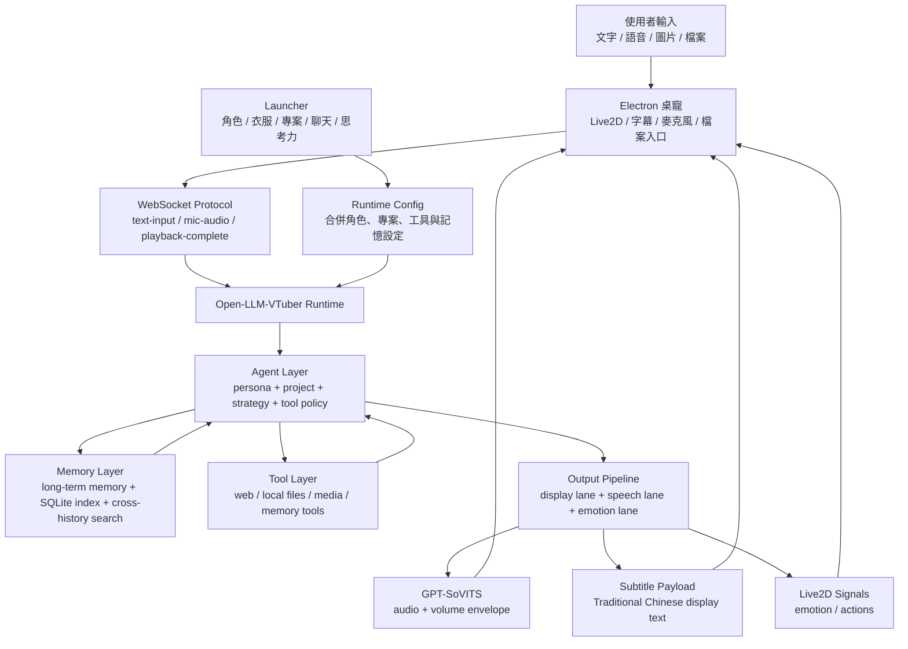
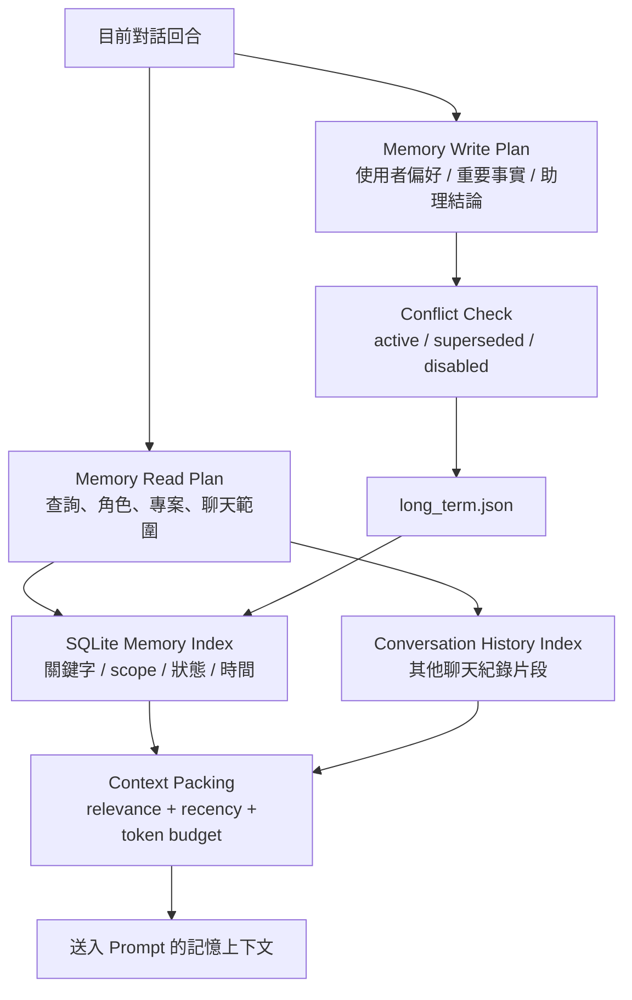
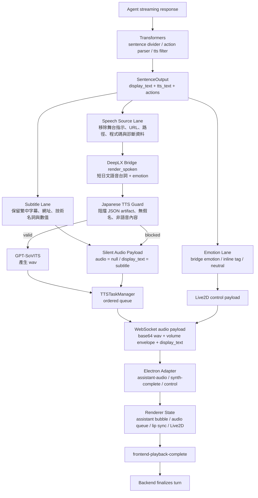

# Kuro Desktop Agent Runtime

Kuro 是一套本地桌面助理 runtime，整合 launcher、Open-LLM-VTuber、GPT-SoVITS、Live2D 桌寵、角色記憶、跨對話檢索、工具路由、檔案理解與專案 prompt。

這個專案的目標不是單純讓聊天機器人回覆文字，而是建立一個可控、可維護、可延伸的角色助理系統。Kuro 需要能理解目前專案脈絡、保留長期記憶、在需要時使用工具，並用字幕、語音與 Live2D 表現出一致的角色狀態。

## 作品定位

Kuro 的核心設計是「有邊界的角色助理」：

- 角色人格由 persona 管理，不讓工具、搜尋、專案 prompt 或語音模型任意改寫角色身份。
- 專案脈絡由 project prompt 管理，讓同一個角色可以切換到不同工作情境。
- 思考力控制搜尋深度、驗證強度與回答完整度，不改變角色人格。
- 工具先經過分類、權限政策與候選篩選，再交給模型決定是否使用。
- 記憶不把所有聊天全文塞回 prompt，而是透過查詢、範圍、衝突狀態與 token budget 篩選。
- 輸出分成字幕、語音與 Live2D 表現層，避免技術資料、網址或診斷文字被送進 TTS。

## 系統架構



## 使用體驗

- 在 launcher 選擇角色、衣服、專案、聊天紀錄與思考力。
- 可以使用一般聊天、專案聊天、網路搜尋、本地檔案讀取與附件分析。
- 可以上傳圖片、音檔、文字、程式碼、壓縮檔或二進位檔；可執行檔只做靜態分析，不執行。
- 工具狀態會顯示在當次對話底下，讓搜尋、檔案讀取與記憶事件留在同一個上下文。
- 每個角色有獨立聊天紀錄與長期記憶，切換回來後可以延續脈絡。

## Launcher

`launcher.py` 是 Kuro 的控制室，負責組合 runtime config、啟停服務、切換角色與專案、管理聊天紀錄、操作記憶，以及把桌寵控制放在對話旁邊。

Launcher 目前分工如下：

- `launcher.py`：主入口與 UI orchestration。
- `kuro_launcher/`：launcher 子模組、設定、服務 helper 與可維護的分類邏輯。
- `kuro_launcher.settings.yaml`：本機路徑、port、模型與啟動預設。
- `projects/`：專案 prompt、工具提示與回覆風格。

## Prompt 與思考力

Kuro 採用分層 prompt，而不是把所有規則塞進單一角色 prompt：

1. System Contract
2. Character Persona
3. Project Context
4. Tool Use Policy
5. Conversation Strategy
6. Expression / Response Contract

思考力只影響對話策略。它決定模型要多快回覆、是否需要多做驗證、搜尋要做到多深、回答要多完整；它不應該改變角色人格。

角色人格放在：

- `Open-LLM-VTuber/prompts/persona/`
- `Open-LLM-VTuber/characters/*.yaml`

專案脈絡放在：

- `projects/<project_id>/project.yaml`
- `projects/<project_id>/prompts/project_prompt.txt`
- `projects/<project_id>/prompts/tool_prompt.txt`
- `projects/<project_id>/prompts/response_style_prompt.txt`

## 記憶模型

記憶是助理能力，不是聊天紀錄全文回放。Kuro 目前使用「長期記憶檔案 + SQLite 索引 + 跨對話檢索」的混合架構，讓角色能在不同聊天之間找回重要資訊，但仍維持範圍、衝突與 token budget 控制。



長期記憶支援：

- Query-aware retrieval：依照目前問題挑選相關記憶。
- Scope levels：區分使用者、角色、專案、聊天與 runtime。
- Assistant outcome：把助理推導出的有用結論納入寫入判斷。
- Conflict handling：新舊資訊衝突時保留狀態，而不是直接覆蓋或重複。
- Soft delete：刪除與停用可以留下可追蹤狀態。
- Cross-history search：必要時可搜尋其他對話片段，作為工具型上下文補充。

## 輸出流

Kuro 的輸出流採用三條 lane：字幕、語音與情緒動作。這是目前表現層最重要的專業化邊界。



### 後端責任

- `tts_filter` 將模型串流輸出整理成 `SentenceOutput`。
- `handle_sentence_output` 將字幕文字、語音文字與動作拆開處理。
- 字幕 lane 先送出 silent audio payload，確保畫面能顯示完整繁中內容。
- 語音 lane 只保留適合朗讀的內容，再交給 bridge 轉成短日文語音台詞。
- TTS guard 會阻擋 JSON 殘留、無假名日文、URL、路徑、程式碼與不適合朗讀的片段。
- `TTSTaskManager` 負責 TTS 非同步任務、輸出排序與 `backend-synth-complete`。

### 前端責任

- `llm-vtuber-adapter` 將 Open-LLM-VTuber websocket payload 轉成 Kuro 內部事件。
- `assistant-audio` 會同時更新字幕與音訊佇列；沒有音訊時仍可更新字幕。
- Renderer 使用 audio queue 順序播放語音，並由音訊 envelope 驅動 lip sync。
- 收到 `synth-complete` 後，前端會等 audio queue 播放完畢，再送出 `frontend-playback-complete`。
- 後端收到播放完成或逾時後，才會送出 `force-new-message` 與 conversation end。

這個設計讓字幕可以完整承載資訊，語音保持乾淨自然，Live2D 表現不干擾角色與工具邏輯。

## 工具模型

工具不是全部丟給模型自由挑。Kuro 先判斷能力分類，再從候選工具中選擇。

目前工具能力分成：

- Web research：輕量搜尋、深度搜尋、來源驗證與頁面讀取。
- Local files：允許根目錄、資料夾列表、文字搜尋與文字讀取。
- Media and attachments：圖片、音檔、文字、壓縮檔與二進位靜態分析。
- Runtime control：保留給 launcher/runtime 狀態與受控操作。
- Memory：保留給記住、忘記、整理、跨對話搜尋與記憶維護。

工具政策預設為 read-only。金鑰、私密設定、瀏覽器個人資料、憑證、私有網路與敏感路徑會被限制層擋下。

## 專案結構

```text
C:\kuro
|-- launcher.py                         # Launcher 主入口
|-- kuro_launcher.settings.yaml          # 路徑、port、模型預設
|-- kuro_launcher/                       # Launcher 子模組與服務 helper
|-- Open-LLM-VTuber/                     # Agent、對話、工具、記憶、TTS pipeline
|-- projects/                            # 專案 prompt 與回覆風格
|-- bridges/                             # 翻譯、語音渲染與 bridge service
|-- gpt_sovits/                          # GPT-SoVITS runtime
|-- pet-electron/                        # Electron + Live2D 桌寵 shell
|-- local_translator/                     # 本地翻譯相關模組
|-- voices/                              # 角色參考音檔
|-- vendor/                              # 專案內供應商或第三方檔案
|-- launcher_logs/                       # Launcher log，不進 git
|-- 暫存區/                              # 圖片與音檔暫存區，不放程式碼
```

## 啟動

```powershell
cd C:\kuro
.\envs\kuro-llm310\python.exe .\launcher.py
```

Launcher 會讀取 `kuro_launcher.settings.yaml`，產生 Open-LLM-VTuber runtime config，並協調本地服務。

桌面捷徑流程可使用：

```text
桌寵啟動器.vbs
```

## 擴充點

- 新角色：`Open-LLM-VTuber/characters/` 與 `Open-LLM-VTuber/prompts/persona/`
- 新專案：`projects/`
- 普通聊天專案：`projects/casual-chat/`
- 工具路由：`Open-LLM-VTuber/tool_catalog.json`
- 工具限制：`Open-LLM-VTuber/tool_policy.json`
- 對話策略：`Open-LLM-VTuber/src/open_llm_vtuber/agent/conversation_strategy_manager.py`
- 記憶管理：`Open-LLM-VTuber/src/open_llm_vtuber/character_memory_manager.py`
- 記憶索引：`Open-LLM-VTuber/src/open_llm_vtuber/character_memory_sql_index.py`
- 跨對話檢索：`Open-LLM-VTuber/src/open_llm_vtuber/conversation_history_index.py`
- 輸出管線：`Open-LLM-VTuber/src/open_llm_vtuber/conversations/conversation_utils.py`
- Electron 輸出接收：`pet-electron/renderer/src/backend/backend-client.ts`

## Repo 邊界

適合進 git：

- source code
- README 與文件
- prompt
- character/project config
- tool catalog/policy
- runtime helper
- 可重現的測試

不適合進 git：

- `.env`
- API key
- launcher log
- runtime 產物
- 聊天紀錄與本機記憶資料
- 參考音檔與模型權重
- 暫存圖片與音檔
- `pet-electron/.tmp/`

## 驗證

常用檢查指令：

```powershell
.\envs\kuro-llm310\python.exe -m unittest .\Open-LLM-VTuber\tests\test_character_memory_manager.py
.\envs\kuro-llm310\python.exe -m unittest .\Open-LLM-VTuber\tests\test_tts_pronunciation_pipeline.py
git diff --check
```

文件修改後至少確認 `git diff --check`，避免 Markdown 或空白格式問題。
