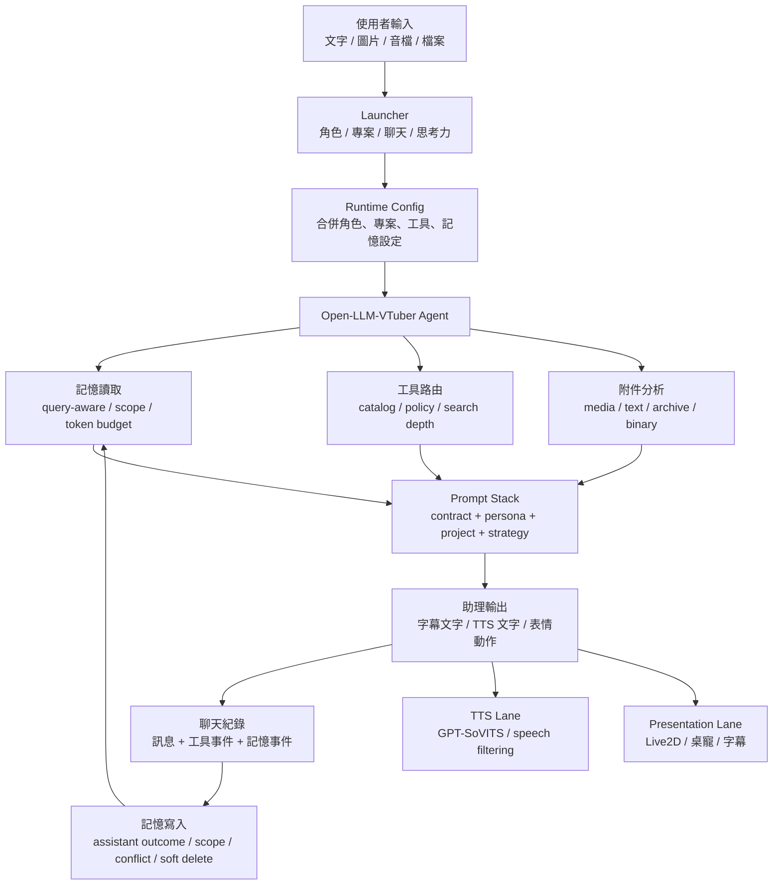
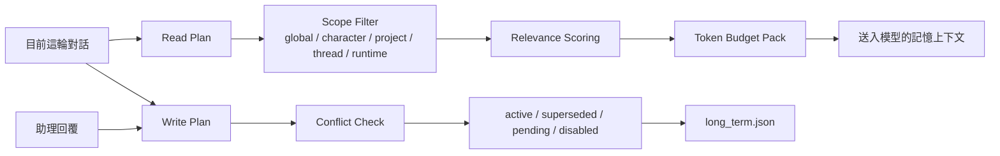

# Kuro Desktop Agent Runtime

Kuro 是一套本地桌面助理 runtime。它把 launcher、Open-LLM-VTuber、GPT-SoVITS、Live2D 桌寵、記憶系統、工具路由、檔案理解與專案 prompt 收在同一個工作區裡。

這個專案的目標不是「讓聊天機器人說話」而已，而是做出一個可以被控制、可以記住脈絡、可以使用工具、可以用字幕與語音表現自己的角色助理。

## 作品定位

Kuro 的核心概念是「有邊界的角色助理」：

- 角色人格由 persona 管理，不讓工具、搜尋或語音模型隨意改寫角色。
- 專案脈絡由 project prompt 管理，讓同一個角色可以進入不同工作情境。
- 思考力控制推理與搜尋深度，而不是改變角色身份。
- 工具先經過分類與權限政策，再交給模型選擇候選工具。
- 記憶不是把所有聊天塞回 prompt，而是依照查詢、範圍、衝突與 token budget 篩選。
- 表現層分成字幕、TTS 與 Live2D，避免技術資料被硬塞進語音。

## 使用體驗

- 在 launcher 選擇角色、衣服、專案、聊天紀錄與思考力。
- 平常可以直接聊天；需要即時資訊時走網路搜尋；需要維護專案時讀本地檔案。
- 可以上傳圖片、音檔、文字、程式碼、壓縮檔或二進位檔。可執行檔只做靜態分析，不執行。
- 工具狀態顯示在當次對話底下，讓搜尋、檔案讀取、記憶事件跟回覆保持同一個上下文。
- 每個角色都有獨立聊天紀錄與長期記憶，方便之後切回來延續。

## 核心流程



## Launcher

`launcher.py` 是 Kuro 的控制室。它負責組合 runtime config、啟停服務、切換角色與專案、管理聊天紀錄、操作記憶，以及把桌寵控制放在對話旁邊。

Launcher 會讓目前狀態保持可見：

- `Bridge`、`LLM`、`TTS`、桌寵狀態。
- 角色、衣服、專案、聊天、記憶分頁。
- 思考力選擇：`快速`、`普通`、`深度`。
- 工具事件以小型文字顯示在當次對話下方。
- 聊天紀錄可新增、切換、刷新與刪除。

## Prompt 與思考力

Kuro 採用分層 prompt，而不是把所有規則塞進單一角色 prompt：

1. `System Contract`
2. `Character Persona`
3. `Project Context`
4. `Tool Use Policy`
5. `Conversation Strategy`
6. `Expression / Response Contract`

思考力只影響對話策略。它決定模型要多快回覆、是否需要多做驗證、搜尋要做到多深、回答要多完整；它不應該改變角色人格。

角色人格放在：

- `Open-LLM-VTuber/prompts/persona/`
- `Open-LLM-VTuber/characters/*.yaml`

專案脈絡放在：

- `projects/<project_id>/project.yaml`
- `projects/<project_id>/prompts/project_prompt.txt`
- `projects/<project_id>/prompts/tool_prompt.txt`

## 記憶模型

記憶是助理能力，不是聊天紀錄的全文回放。



長期記憶支援：

- Query-aware retrieval：依照目前問題挑選相關記憶。
- Scope levels：區分使用者、角色、專案、聊天與 runtime。
- Assistant outcome：把助理推導出的有用結論納入寫入判斷。
- Conflict handling：新舊資訊衝突時保留狀態，而不是直接覆蓋或重複。
- Soft delete：刪除與停用可以留下可追蹤狀態。

## 工具模型

工具不是全部丟給模型自由挑。Kuro 先判斷能力分類，再從候選工具中選擇。

目前工具能力分成：

- Web research：輕量搜尋、深度搜尋、來源驗證與頁面讀取。
- Local files：允許根目錄、資料夾列表、文字搜尋與文字讀取。
- Media and attachments：圖片、音檔、文字、壓縮檔與二進位靜態分析。
- Runtime control：保留給 launcher/runtime 狀態與受控操作。
- Memory：保留給記住、忘記、整理與記憶維護。

工具政策預設為 read-only。金鑰、私密設定、瀏覽器個人資料、憑證、私有網路與敏感路徑會被限制層擋下。

## 表現層

Kuro 把「顯示給使用者看的內容」和「送進語音模型的內容」分開。

- 字幕可以保留網址、引用、技術名詞、英文片段與數值。
- TTS 只讀適合語音的句子，避免日文聲線硬讀中文、英文、URL 或診斷資料。
- Live2D/桌寵接收表情與動作提示，不承擔角色人格邏輯。

這樣可以讓畫面資訊完整，同時讓語音保持乾淨、穩定、符合角色。

## 專案結構

```text
C:\kuro
|-- launcher.py                         # Launcher 與控制面板
|-- kuro_launcher.settings.yaml          # 路徑、port、模型預設
|-- kuro_launcher/                       # Runtime config 與服務 helper
|-- Open-LLM-VTuber/                     # Agent、對話、工具、記憶、TTS bridge
|-- projects/                            # 專案 prompt 與 tool prompt
|-- voices/                              # 角色參考音檔
|-- gpt_sovits/                          # GPT-SoVITS runtime
|-- pet-electron/                        # 桌寵 shell
|-- bridges/                             # 翻譯與 bridge service
|-- launcher_logs/                       # Launcher log
|-- 暫存區/                              # 圖片與音檔暫存區，不放程式碼
```

## 啟動

```powershell
cd C:\kuro
.\envs\kuro-llm310\python.exe .\launcher.py
```

Launcher 會讀取 `kuro_launcher.settings.yaml`，產生 Open-LLM-VTuber runtime config，並協調本地服務。

桌面捷徑流程可使用：

```text
桌寵啟動器.vbs
```

## 擴充點

- 新角色：`Open-LLM-VTuber/characters/` 與 `Open-LLM-VTuber/prompts/persona/`
- 新專案：`projects/`
- 工具路由：`Open-LLM-VTuber/tool_catalog.json`
- 工具限制：`Open-LLM-VTuber/tool_policy.json`
- 對話策略：`Open-LLM-VTuber/src/open_llm_vtuber/agent/conversation_strategy_manager.py`
- 記憶系統：`Open-LLM-VTuber/src/open_llm_vtuber/character_memory_manager.py`

## Repo 邊界

適合進 git：

- source code
- prompt
- character/project config
- tool catalog/policy
- runtime helper

不適合進 git：

- `.env`
- API key
- launcher log
- runtime 產物
- 參考音檔
- 模型權重
- 暫存圖片與音檔
