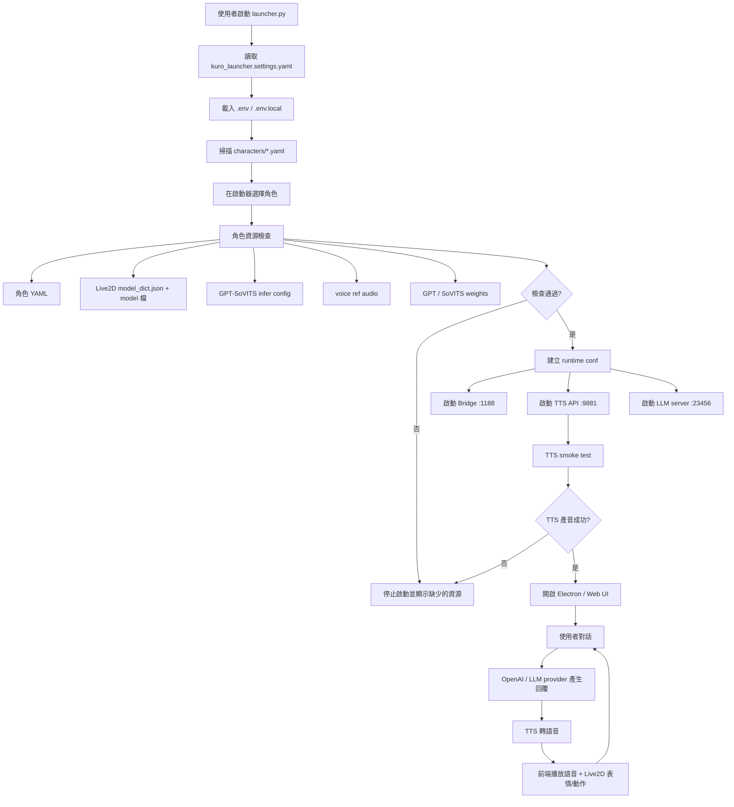

# Kuro Desktop Agent Runtime

這份專案是一個桌面角色啟動器整合包。主要入口是 `launcher.py`，目標是讓使用者從啟動器選擇角色，並讓每個角色都能擁有獨立的 prompt、Live2D 模型、TTS 聲音與記憶識別。

目前專案已攤平成單一 Git repo，`Open-LLM-VTuber`、`gpt_sovits`、launcher、bridge、角色設定都由根目錄的 Git 統一管理。模型權重、音檔、環境、log 與本機 secret 不提交。

## 啟動方式

一般使用時只需要從根目錄啟動 launcher：

```powershell
cd C:\kuro
.\envs\kuro-llm310\python.exe .\launcher.py
```

也可以直接使用桌面捷徑或 `桌寵啟動器.vbs`，但專案邏輯仍以 `launcher.py` 為入口。

launcher 會負責：

- 讀取 `kuro_launcher.settings.yaml`
- 讀取本機 `.env` / `.env.local`
- 掃描 `Open-LLM-VTuber/characters/*.yaml`
- 讓使用者選擇角色
- 檢查角色資源是否完整
- 啟動 Bridge、GPT-SoVITS TTS、Open-LLM-VTuber LLM server
- 生成 runtime config 到 `Open-LLM-VTuber/conf.launcher_runtime.yaml`
- 開啟 Electron 或 Web UI

## 整體流程圖



## 主要資料夾

| 路徑 | 用途 |
| --- | --- |
| `launcher.py` | 桌面啟動器入口 |
| `kuro_launcher/` | 啟動器設定、程序管理、角色檢查、runtime config 產生 |
| `kuro_launcher.settings.yaml` | 本機路徑、port、LLM provider 設定 |
| `Open-LLM-VTuber/` | LLM server、前端、Live2D、角色 runtime |
| `Open-LLM-VTuber/characters/` | 每個角色一份 YAML |
| `Open-LLM-VTuber/live2d-models/` | Live2D 模型資源 |
| `Open-LLM-VTuber/model_dict.json` | Live2D 模型索引與表情對照 |
| `gpt_sovits/` | GPT-SoVITS TTS 服務 |
| `gpt_sovits/GPT_SoVITS/configs/` | TTS infer 設定，命名為 `tts_infer_<角色名>.yaml` |
| `voices/` | 角色參考音資料夾，音檔不提交 |
| `bridges/` | 翻譯/文字處理 bridge |
| `launcher_logs/` | launcher 與服務 log，不提交 |

## 角色資料關係

目前角色是「一個角色一份 YAML」：

- `Open-LLM-VTuber/characters/kuro.yaml`
- `Open-LLM-VTuber/characters/yumi.yaml`
- `Open-LLM-VTuber/characters/mao_pro.yaml`
- `Open-LLM-VTuber/characters/shizuku.yaml`

角色 YAML 內最重要的欄位：

- `conf_name`：角色設定名稱
- `conf_uid`：角色記憶識別 ID，應保持唯一
- `live2d_model_name`：對應 `model_dict.json` 的 `name`
- `character_name` / `human_name`：角色顯示名稱與使用者稱呼
- `persona_prompt`：角色人格與行為 prompt
- `agent_config.agent_settings.basic_memory_agent.llm_provider`：LLM provider
- `agent_config.llm_configs.openai_llm`：OpenAI 模型設定
- `tts_config.tts_model`：TTS 類型，目前主要使用 `gpt_sovits_tts`
- `tts_config.gpt_sovits_tts.ref_audio_path`：角色參考音路徑
- `tts_config.gpt_sovits_tts.prompt_text`：參考音對應文字

## 本機 Secret

API key 不寫進角色 YAML，也不提交到 Git。

請把本機 key 放在 `.env`：

```powershell
OPENAI_API_KEY=你的 key
OPENAI_LLM_API_KEY=
OPENAI_LLM_MODEL=gpt-4o
OPENAI_LLM_TEMPERATURE=1.0
OPENAI_LLM_INJECT_KEY=1
KURO_LLM_PROVIDER=openai_llm
```

`.env` 已被 `.gitignore` 排除。可提交的範例是 `.env.example`。

## Git 規則

會提交：

- launcher 程式
- Open-LLM-VTuber 程式與前端靜態檔
- GPT-SoVITS 程式
- 角色 YAML
- Live2D 模型檔
- 說明文件
- `.env.example`

不提交：

- `.env`
- `launcher_logs/`
- `envs/`
- `gsv-tts/`
- `Open-LLM-VTuber/conf.launcher_runtime.yaml`
- `Open-LLM-VTuber/logs/`
- `voices/**/*.wav`
- `*.ckpt`
- `*.pth`
- `*.onnx`
- `gpt_sovits/GPT_weights*/`
- `gpt_sovits/SoVITS_weights*/`
- `gpt_sovits/GPT_SoVITS/pretrained_models/`
- `暫存區/`

## 目前注意事項

- `kuro` 是目前最完整的角色基底。
- `mao_pro` 與 `shizuku` 已切成獨立 placeholder，但缺少完整 TTS 參考音與權重時，launcher 會阻擋啟動。
- 若新增角色暫時沒有自己的資料，可以先建空白 placeholder，但不要指回其他角色的音檔或權重，避免角色混用。
- 若曾經把 API key 放進檔案或 log，建議更換 key。

## 相關文件

- `新增腳色說明.txt`：新增角色的詳細步驟
- `說明.txt`：早期手動啟動筆記，之後可逐步整理或移除
