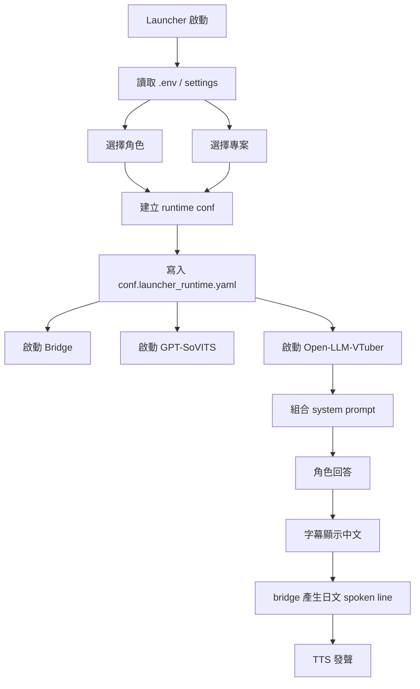

# Kuro Desktop Agent Runtime

這份專案把 `launcher`、`Open-LLM-VTuber`、`gpt_sovits`、`bridge` 和角色資料整理成同一個 repo，目標是用啟動器選角色、選專案，再把不同層級的 prompt 組成同一條對話流程。

目前新的方向是：

- 角色人格 prompt 獨立成檔
- 專案 prompt 與 tool prompt 獨立成檔
- 輸出格式 / 系統契約 prompt 由系統統一提供
- 記憶仍然維持「一個角色一份」，不因專案切開

## 啟動

```powershell
cd C:\kuro
.\envs\kuro-llm310\python.exe .\launcher.py
```

launcher 會讀：

- [C:\kuro\kuro_launcher.settings.yaml](C:/kuro/kuro_launcher.settings.yaml)
- `.env` / `.env.local`
- `Open-LLM-VTuber/characters/*.yaml`
- `projects/*/project.yaml`

## 目前架構

### 1. 角色層

每個角色仍然是一份 YAML：

- [C:\kuro\Open-LLM-VTuber\characters\kuro.yaml](C:/kuro/Open-LLM-VTuber/characters/kuro.yaml)
- [C:\kuro\Open-LLM-VTuber\characters\mao_pro.yaml](C:/kuro/Open-LLM-VTuber/characters/mao_pro.yaml)
- [C:\kuro\Open-LLM-VTuber\characters\shizuku.yaml](C:/kuro/Open-LLM-VTuber/characters/shizuku.yaml)
- [C:\kuro\Open-LLM-VTuber\characters\yumi.yaml](C:/kuro/Open-LLM-VTuber/characters/yumi.yaml)

角色 YAML 目前保留：

- `conf_name`
- `conf_uid`
- `live2d_model_name`
- `agent_config`
- `tts_config`
- `persona_prompt_path`
- `default_project_id`

`persona_prompt` 舊欄位還在，但現在如果 `persona_prompt_path` 有值，執行時會優先讀外部檔案。

### 2. 專案層

專案配置放在 `projects/`：

- [C:\kuro\projects\desktop-agent-runtime\project.yaml](C:/kuro/projects/desktop-agent-runtime/project.yaml)

目前 `project.yaml` 會管理：

- `project_id`
- `display_name`
- `project_root`
- `prompts.project_prompt`
- `prompts.tool_prompt`

### 3. Prompt 分層

執行時的 system prompt 現在會依序組成：

1. `System Contract`
2. `Character Persona`
3. `Project Context`
4. `Tool Use Policy`
5. `Expression Contract`

對應來源如下：

- 系統格式 prompt：  
  [C:\kuro\Open-LLM-VTuber\prompts\utils\response_contract_prompt.txt](C:/kuro/Open-LLM-VTuber/prompts/utils/response_contract_prompt.txt)
- 角色 prompt：  
  [C:\kuro\Open-LLM-VTuber\prompts\persona](C:/kuro/Open-LLM-VTuber/prompts/persona)
- 專案 prompt：  
  [C:\kuro\projects\desktop-agent-runtime\prompts\project_prompt.txt](C:/kuro/projects/desktop-agent-runtime/prompts/project_prompt.txt)
- tool prompt：  
  [C:\kuro\projects\desktop-agent-runtime\prompts\tool_prompt.txt](C:/kuro/projects/desktop-agent-runtime/prompts/tool_prompt.txt)
- Live2D 表情契約：  
  [C:\kuro\Open-LLM-VTuber\prompts\utils\live2d_expression_prompt.txt](C:/kuro/Open-LLM-VTuber/prompts/utils/live2d_expression_prompt.txt)

## 目前預設

這次調整後，prompt 檔案狀態是：

- `response_contract_prompt.txt`：已填入系統輸出格式規則
- `persona/*.txt`：先留空，等你重寫
- `project_prompt.txt`：先留空，等你重寫
- `tool_prompt.txt`：先留空，等你重寫

也就是說，現在系統只先保留「輸出格式 / 系統契約」這層，其他人格與專案內容都交給你後續補。

## 記憶規則

目前仍然是「一角色一份記憶」。

也就是：

- 切換專案不會切掉角色記憶
- 記憶主要仍跟 `conf_uid` 走

這符合現在的需求：同一個角色換專案時，仍然像同一個人，只是工作上下文不同。

## Launcher 現況

新的 launcher 已改成 `CustomTkinter`，重點是：

- 左側選角色
- 中間選專案
- 右側看目前組合、服務控制與 prompt 預覽
- 下方看執行 log

目前啟動流程：



## 你接下來主要會改的地方

如果要正式重寫角色與工作模式，優先會碰這幾個檔案：

- 角色人格：
  [C:\kuro\Open-LLM-VTuber\prompts\persona\kuro.txt](C:/kuro/Open-LLM-VTuber/prompts/persona/kuro.txt)
- 專案規則：
  [C:\kuro\projects\desktop-agent-runtime\prompts\project_prompt.txt](C:/kuro/projects/desktop-agent-runtime/prompts/project_prompt.txt)
- tool 規則：
  [C:\kuro\projects\desktop-agent-runtime\prompts\tool_prompt.txt](C:/kuro/projects/desktop-agent-runtime/prompts/tool_prompt.txt)

如果要新增一個新專案，就複製一份 `projects/<new-project>/project.yaml` 和它的 `prompts/` 即可。

## 注意

- `.env` 不會進 git
- 角色記憶目前不做專案隔離
- 角色 YAML 裡舊的 `persona_prompt` 仍存在，但現在外部檔路徑優先
- `kuro` 目前仍沿用你先前說的 `kuro = yuki` 狀態，這次沒有改人設內容
