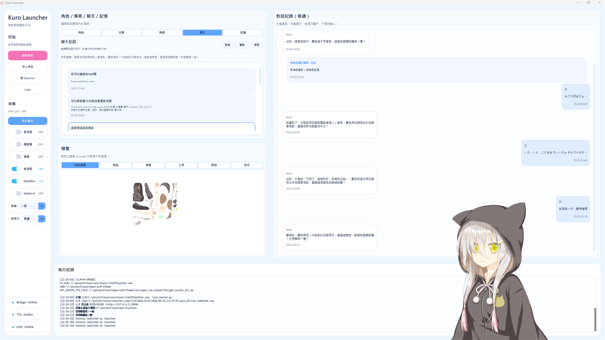
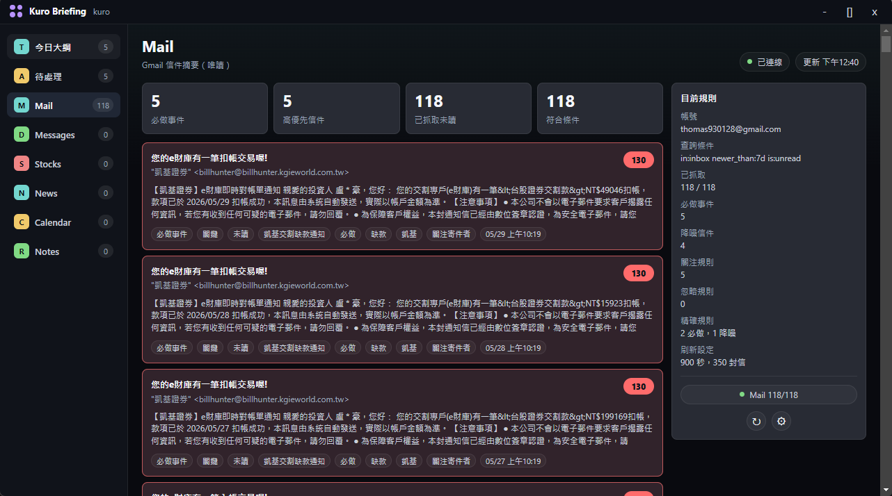
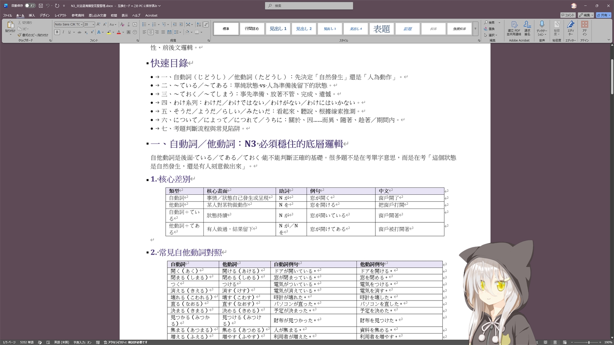
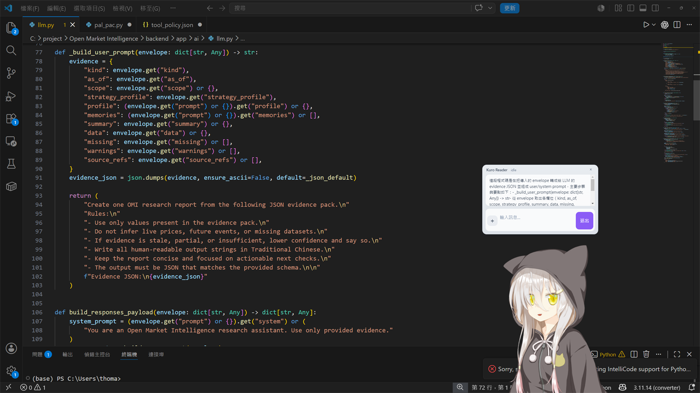
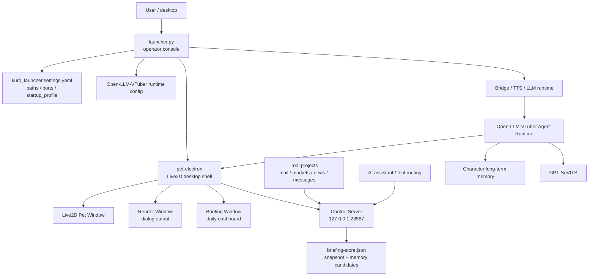
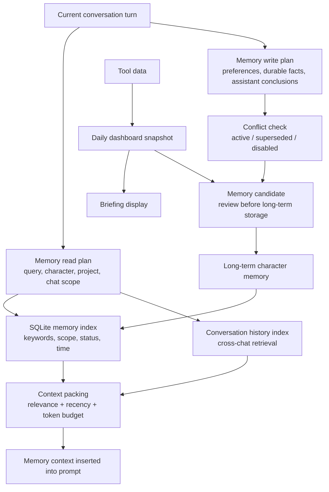
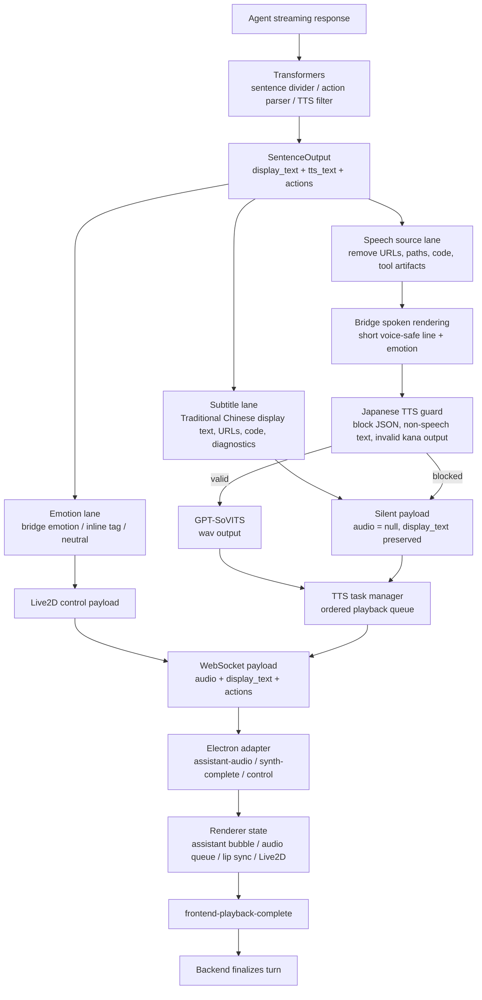
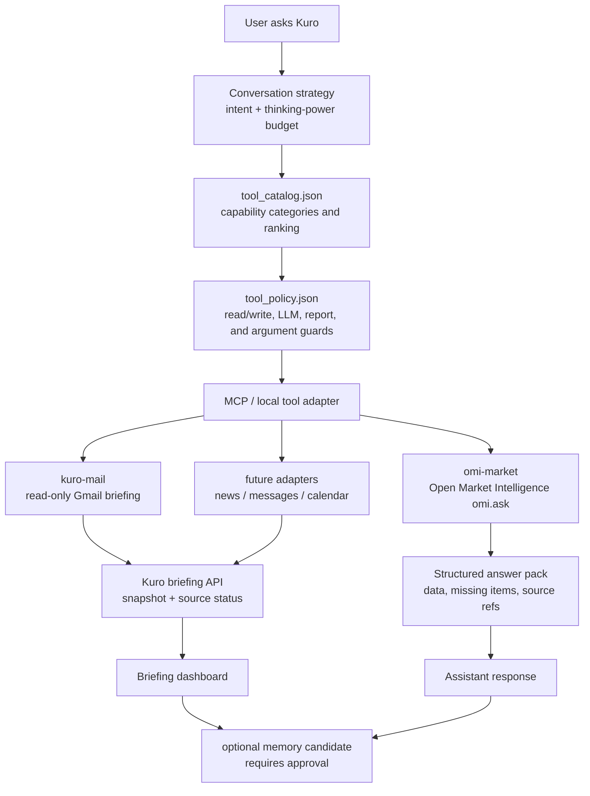

# Kuro Desktop Agent Runtime

Kuro is a local-first desktop AI companion runtime. It combines a launcher,
Open-LLM-VTuber, GPT-SoVITS voice output, a Live2D Electron pet shell, project
prompts, memory controls, tool policies, and a persistent desktop briefing panel
into one controllable workspace.

<p align="center">
  
</p>

This repository is not just a character demo. It is the runtime workspace for a
desktop assistant that can stay on screen, speak through a local TTS stack,
remember approved long-term context, route task-specific tools, and display
structured daily intelligence beside the character.

> Status: source-controlled local runtime workspace. Local secrets, model
> weights, generated configs, logs, chat history, memory databases, Electron
> userData, build output, voice references, and dependency folders are
> intentionally excluded from git.

## Visual Tour

| Launcher and runtime | Briefing dashboard |
| --- | --- |
|  |  |

| Desktop companion | Coding companion |
| --- | --- |
|  |  |

## What Kuro Does

- Starts a selected character, project context, outfit, and services from one
  launcher.
- Runs a Live2D desktop companion through a custom Electron shell.
- Keeps dialog output separate from structured daily briefing output.
- Uses approval-based memory flow so volatile daily information does not
  automatically pollute long-term character memory.
- Routes domain tools through explicit policy files instead of letting the
  assistant call arbitrary capabilities.
- Treats external tools such as mail, market intelligence, news, and messages as
  separate projects that push structured outputs into Kuro.

## Current Milestone

The current integrated desktop assistant layer includes:

- `startup_profile` selection for default character, project, outfit, and
  optional auto-start behavior.
- Default startup target: `kuro` / `desktop-agent-runtime` / `hoodie`.
- Unified Windows AppUserModelID: `kuro.desktop-agent`.
- Electron `Reader` window for dialog/subtitle output.
- Electron `Briefing` window for persistent dashboard output.
- Launcher controls for microphone, camera, screen, Reader, Dashboard, Game
  mode, expression, and thinking-power state.
- Briefing backend store with separate snapshot and memory-candidate data.
- Local control server APIs for dashboard updates and runtime state.

## Architecture



Important boundaries:

- The launcher decides which runtime profile should start.
- Open-LLM-VTuber handles conversation, prompt composition, tools, and memory.
- Electron owns the desktop windows, tray behavior, taskbar identity, local
  control server, Reader, and Briefing UI.
- External tools should publish structured results into Kuro through explicit
  local APIs rather than becoming hidden logic inside the character prompt.

## Repository Layout

| Path | Responsibility |
| --- | --- |
| `launcher.py` | Main launcher UI, startup profile application, service orchestration, and pet shell controls. |
| `kuro_launcher/` | Launcher config parsing, service helpers, runtime config generation, memory panel, and records. |
| `kuro_launcher.settings.yaml` | Local runtime source of truth for paths, ports, LLM env names, and startup profile. |
| `Open-LLM-VTuber/` | Agent runtime, WebSocket protocol, character configs, prompt/runtime logic, MCP/tool integration, and memory system. |
| `pet-electron/` | Electron shell, Live2D renderer, Reader window, Briefing window, tray controls, and local control server. |
| `bridges/` | Bridge service helpers, including translation and spoken-rendering integration. |
| `gpt_sovits/` | GPT-SoVITS runtime and TTS configuration. |
| `projects/` | Project prompt packs and assistant context definitions. |
| `docs/assets/readme/` | Public README screenshots and visual assets. |
| `voices/` | Local voice references and generated voice assets. Keep private data out of git. |
| `launcher_logs/` | Local launcher logs. Do not commit. |
| `envs/` | Local Python environments. Do not commit. |

## Quick Start

From the repository root:

```powershell
cd C:\project\kuro
.\envs\kuro-llm310\python.exe .\launcher.py
```

The VBS launcher can also be used from Explorer:

```text
桌寵啟動器.vbs
```

The launcher prefers the repository-local Python runtime:

```text
envs\kuro-llm310\python.exe
```

and falls back to:

```powershell
py .\launcher.py
```

This project currently assumes a prepared local runtime environment. It is a
working desktop assistant workspace, not a one-command public installer.

## Configuration

The main configuration file is:

```text
kuro_launcher.settings.yaml
```

Key sections:

```yaml
paths:
  ROOT: "${HERE}"
  open_llm_vtuber_dir: "${ROOT}\\Open-LLM-VTuber"
  projects_dir: "${ROOT}\\projects"
  pet_electron_dir: "${ROOT}\\pet-electron"
  runtime_conf_path: "${open_llm_vtuber_dir}\\conf.launcher_runtime.yaml"

startup_profile:
  character: "kuro"
  project: "desktop-agent-runtime"
  outfit: "hoodie"
  auto_start: true

network:
  bridge:
    host: "127.0.0.1"
    port: 1188
  tts:
    host: "127.0.0.1"
    port: 9981
  llm:
    host: "127.0.0.1"
    port: 23456
  pet_control:
    host: "127.0.0.1"
    port: 23567
```

Secrets must stay in local environment files or OS environment variables, not in
tracked files:

```powershell
Copy-Item .env.example .env
notepad .env
```

Common LLM variables:

| Variable | Purpose |
| --- | --- |
| `KURO_LLM_PROVIDER` | Runtime LLM provider selector. |
| `OPENAI_LLM_API_KEY` | OpenAI-compatible LLM API key. |
| `OPENAI_API_KEY` | Fallback key used by compatible integrations. |
| `OPENAI_LLM_MODEL` | Default OpenAI-compatible LLM model. |
| `OPENAI_LLM_TEMPERATURE` | Optional temperature override. |
| `OPENAI_TRANSLATE_MODEL` | Bridge / spoken-rendering model. |
| `ENABLE_OLLAMA_FALLBACK` | Enables local Ollama fallback when configured. |
| `OLLAMA_BASE_URL` | Ollama-compatible endpoint. |

## Launcher

The launcher is the operator console. It handles:

- Start/stop profile.
- Start/stop Bridge, TTS, and LLM runtime.
- Electron pet shell startup.
- Character, outfit, project, chat, and memory selection.
- Memory panel CRUD and approval controls.
- Pet shell status polling.
- Reader, Dashboard, Game mode, expression, and thinking-power controls.

The launcher and Electron shell share the same Windows AppUserModelID:

```text
kuro.desktop-agent
```

This groups the launcher, pet, Reader, and Dashboard windows together on the
Windows taskbar.

## Electron Pet Shell

The Electron shell lives in `pet-electron/`.

Useful commands:

```powershell
Set-Location .\pet-electron
npm run check:renderer
npm run build:renderer
npm run start
```

Main pieces:

| File | Responsibility |
| --- | --- |
| `src/main.js` | Electron main process, windows, tray menu, IPC, and control server wiring. |
| `src/state.js` | Persistent pet shell state such as window bounds and visibility. |
| `src/main-process/control-server.js` | Local HTTP control server. |
| `src/main-process/menus.js` | Tray and pet context menus. |
| `src/reader-window.html` | Dialog/subtitle Reader window. |
| `src/briefing-window.html` | Dashboard / Briefing window. |
| `src/main-process/briefing-store.js` | Backend store for Dashboard snapshot and memory candidates. |
| `renderer/` | TypeScript / Live2D renderer source. |

The shell stores runtime state under Electron `userData`, not in the repository:

```text
pet-shell-state.json
briefing-store.json
pet-shell.log
```

## Briefing Dashboard

The Briefing window is the persistent information surface for assistant and tool
output. It is separate from the character dialog so Kuro can show structured
daily context without turning every transient item into long-term memory.

Current dashboard roles:

- Kuro pet: conversational and personality interface.
- Reader: short dialog or subtitle output.
- Briefing: structured daily intelligence and assistant output.
- Launcher: runtime control and engineering console.

The first version includes sections such as:

- Today
- Tasks
- Mail
- Messages
- Stocks
- News
- Calendar
- Notes

Dashboard data is split into:

| Data | Purpose |
| --- | --- |
| `snapshot` | Today's visible Dashboard data. Safe to update frequently. |
| `memoryCandidates` | Suggestions that may become long-term memory only after approval. |
| `sourceStatus` | Health/status state for mail, news, stocks, messages, and other adapters. |

Control APIs are exposed through the pet shell control server:

```http
GET  /briefing
POST /briefing/snapshot
POST /briefing/memory-candidates
POST /briefing/memory-candidate-status
POST /command
```

Example snapshot update:

```powershell
$body = @{
  title = "Daily Briefing"
  sections = @(
    @{
      key = "overview"
      label = "Today"
      icon = "T"
      subtitle = "Tool summary"
      modules = @(
        @{
          id = "mail"
          title = "Important Mail"
          tag = "Mail"
          value = "2"
          unit = "items"
          wide = $true
          items = @(
            @{ text = "Two messages need a reply today"; meta = "high" }
          )
        }
      )
    }
  )
} | ConvertTo-Json -Depth 8

Invoke-RestMethod `
  -Method Post `
  -Uri "http://127.0.0.1:23567/briefing/snapshot" `
  -Body $body `
  -ContentType "application/json"
```

## Memory Model

Memory is intentionally separate from Dashboard content:



Long-term memory should store stable facts and preferences:

- preferred Dashboard layout
- recurring topics
- watchlist preferences
- role or project defaults
- writing and response style preferences

Daily snapshots should store volatile information:

- today's news
- today's mail summary
- market movement
- message queue
- temporary tasks

Only approved candidates should enter character long-term memory. This keeps the
assistant useful without filling memory with one-day noise.

## Output Pipeline

Kuro separates what the user sees, what the voice engine speaks, and what the
Live2D shell animates. This keeps technical content readable while preventing
URLs, diagnostics, code, or tool artifacts from leaking into speech.



## Tool Integration

Kuro should not own every external connector directly. Serious domain tools
should stay in their own projects and publish typed outputs into Kuro.

Recommended model:



Current stock and market integration uses Open Market Intelligence as the domain
owner:

```text
Kuro user question
  -> tool_catalog / tool_policy
  -> omi-market MCP server
  -> OMI MCP omi.ask
  -> OMI POST /api/ai/ask
```

Tracked routing files:

| File | Role |
| --- | --- |
| `Open-LLM-VTuber/tool_catalog.json` | Exposes market intelligence and `omi.ask` as the stock/market tool category. |
| `Open-LLM-VTuber/tool_policy.json` | Allows read-only `omi.ask` and blocks report/LLM/write arguments by default. |
| `Open-LLM-VTuber/src/open_llm_vtuber/mcpp/tool_catalog_manager.py` | Implements OMI-first routing and web-as-enrichment ranking. |
| `Open-LLM-VTuber/src/open_llm_vtuber/mcpp/tool_policy_manager.py` | Enforces argument-level policy guards before tool execution. |

Local enablement files are intentionally ignored by git:

| Local file | Required local setting |
| --- | --- |
| `Open-LLM-VTuber/mcp_servers.json` | Register `omi-market` and point it at the Open Market Intelligence MCP server. |
| `Open-LLM-VTuber/characters/kuro.yaml` | Add enabled MCP servers for the local `kuro` character. |

## Runtime Ports

Default local ports from `kuro_launcher.settings.yaml`:

| Service | Host | Port | Notes |
| --- | --- | --- | --- |
| Bridge | `127.0.0.1` | `1188` | Translation and spoken-rendering bridge. |
| TTS | `127.0.0.1` | `9981` | GPT-SoVITS API endpoint used by launcher runtime config. |
| LLM runtime | `127.0.0.1` | `23456` | Open-LLM-VTuber backend. |
| Pet control | `127.0.0.1` | `23567` | Electron shell control server. |

The runtime config builder writes the GPT-SoVITS `api_url` from the configured
TTS host and port:

```text
http://<tts_host>:<tts_port>/tts
```

## Validation

Python syntax checks:

```powershell
.\envs\kuro-llm310\python.exe -m py_compile .\launcher.py .\kuro_launcher\config.py .\kuro_launcher\runtime_conf.py
```

Electron main-process checks:

```powershell
node --check .\pet-electron\src\main.js
node --check .\pet-electron\src\state.js
node --check .\pet-electron\src\main-process\control-server.js
node --check .\pet-electron\src\main-process\briefing-store.js
node --check .\pet-electron\src\briefing-preload.js
```

Renderer checks:

```powershell
Set-Location .\pet-electron
npm run check:renderer
npm run build:renderer
```

Runtime smoke checks when the pet shell is running:

```powershell
Invoke-RestMethod http://127.0.0.1:23567/status
Invoke-RestMethod http://127.0.0.1:23567/briefing
```

Git whitespace check:

```powershell
git diff --check
```

## Git Hygiene

Commit:

- source code
- launcher/runtime helpers
- prompt/config templates
- safe character/project metadata
- documentation
- README screenshots
- placeholder configs

Do not commit:

- `.env`, `.env.local`
- API keys, tokens, cookies, credentials
- `open_ai_api.txt`
- `launcher_logs/`
- generated runtime config
- chat history and memory data
- Electron `userData`
- model weights
- private voice references
- `pet-electron/node_modules/`
- `pet-electron/renderer-dist/`
- `pet-electron/.tmp/`
- Python virtual environments under `envs/`

## Suggested GitHub Metadata

Repository description:

```text
Local-first desktop AI companion runtime integrating launcher, Open-LLM-VTuber, GPT-SoVITS, Live2D, memory, tools, and project prompts.
```

Suggested topics:

```text
desktop-agent
ai-companion
live2d
electron
open-llm-vtuber
gpt-sovits
local-first
voice-assistant
python
typescript
```

GitHub metadata is remote repository state, not git content.
