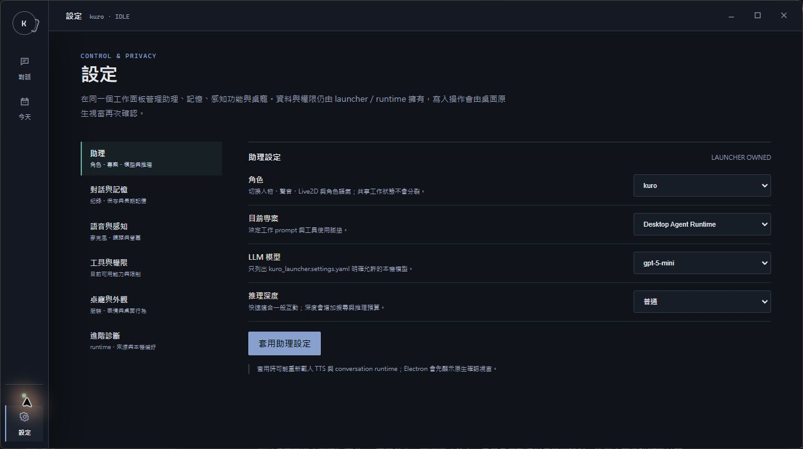
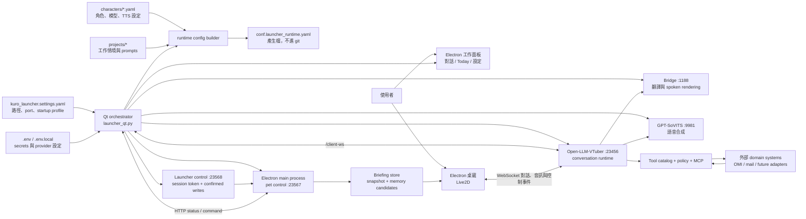
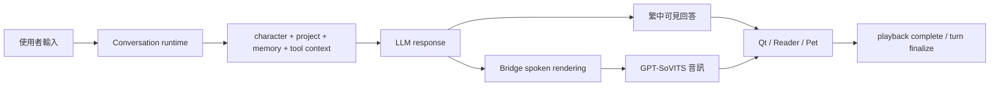
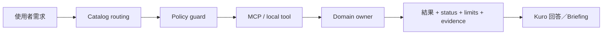
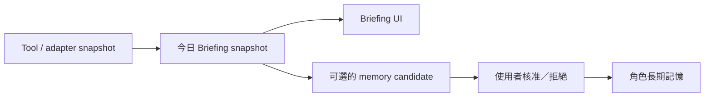

# Kuro

**Windows 上的 local-first 個人 AI 工作經理。**

Kuro 把工作面板、Live2D 桌寵、Reader、Briefing、角色語音、受控工具與本機記憶整合在同一套桌面 runtime。它服務單一使用者，整理分散的工作狀態，說明現在該注意什麼、為什麼重要，以及下一步可以做什麼。

角色、語音與 Live2D 是互動介面。工作狀態、工具權限與外部資料的真相來源仍由明確的系統 contract 管理，不交給角色 prompt 或展示層自行判斷。

<p align="center">
  
</p>

<p align="center"><sub>2026-08-24 實際運行畫面。為避免把對話、郵件或行事曆等私人內容放進 repo，主圖使用無私人資料的設定頁。</sub></p>

> **目前大版本：`1.0.0`**
>
> 這個版本定義 Kuro 的第一個產品基線：工作面板是主要入口，Qt Launcher 回到背景 orchestration 與診斷角色，對話、Reader、Briefing、桌寵、語音與受控工具由同一套本機 runtime 協作。`kuro_core/` 目前仍是 shadow-only；`1.0.0` 不代表新版 Core 或整份 Roadmap 已完成 cutover。

這份 README 記錄目前程式的 **現況架構（as-is）**、啟動方式與責任邊界。長期產品方向放在 [`docs/product/`](docs/product/)，單次實作與驗證證據放在 [`docs/agent-runs/`](docs/agent-runs/)。

## 導覽

- [Kuro 1.0.0 能做什麼](#kuro-100-能做什麼)
- [介面與背景元件](#介面與背景元件)
- [系統全貌](#系統全貌)
- [元件責任地圖](#元件責任地圖)
- [設定、資料與安全邊界](#設定與資料真相來源)
- [啟動方式](#啟動方式)
- [開發與驗證](#開發與驗證)
- [已知限制](#目前已知的架構債)

## Kuro 1.0.0 能做什麼

- 由 `桌寵啟動器.vbs` 依 startup profile 啟動整套 runtime；Qt orchestrator 正常情況在背景運作，Electron 工作面板先顯示並持續回報各服務狀態。
- 在單一工作面板切換普通對話、Today／行事曆與設定；對話模式內可管理歷史、附件、感知輸入、模型與推理深度。
- 以 Live2D 桌寵承載短互動與狀態提示，以 Reader 呈現長回答與附件，以 Briefing 呈現可掃描的結構化資訊。
- 將繁中可見回答整理成適合角色語音的日文短摘要，再交給 GPT-SoVITS 合成；語音失敗不影響完整文字結果。
- 透過 tool catalog、tool policy 與 MCP／本機 adapter 使用外部能力；write、delete、send、publish、長期記憶寫入與高成本操作預設需要確認。
- 管理角色長期記憶，並把 Briefing snapshot、tool result 與待審核 memory candidate 分開保存。
- 保留外部 domain ownership。市場資料、freshness、證據與判斷由 OMI 負責，Kuro 只消費並呈現結果與限制。
- 提供 shadow-only Kuro Core v0，驗證 versioned observation、freshness、SQLite persistence 與 decision trace；目前不取代 legacy Today／Briefing path。

本機環境已完成時，可直接執行 `桌寵啟動器.vbs`。完整需求與命令見[啟動方式](#啟動方式)。

<p align="center">
  
</p>

<p align="center"><sub>同一次 runtime 實際顯示的 Live2D 桌寵；僅裁出角色區域，未帶入桌面背景內容。</sub></p>

> `docs/assets/readme/` 內其餘舊截圖與概念圖素材只保留作為介面演進記錄，不代表 Kuro 1.0.0 的目前視覺。

## 介面與背景元件

| 介面 | 現在的責任 | 不應承擔的責任 |
| --- | --- | --- |
| **工作面板** | 唯一可見主介面；承載普通對話、Today／行事曆、來源預覽、詳情與設定。 | Runtime orchestration、domain truth 或繞過 tool policy 的寫入。 |
| **Live2D 桌寵** | 常駐角色、表情、動作、音訊播放、lip sync、簡短對話提示。 | Tool orchestration、資料分析或長期記憶政策。 |
| **Qt 控制台** | 背景管理 profile、服務生命週期與狀態；只有失敗或直接啟動 `launcher_qt.py` 時顯示診斷 UI。 | 正常啟動時成為第二個主面板。 |
| **Reader／舊 Briefing contract** | 保留既有 IPC 與資料相容性，供工作面板漸進採用。 | 正常啟動時自動形成另一套主要導航。 |

## 系統全貌


```mermaid
flowchart LR
    User["使用者"] --> WorkPanel["Electron 工作面板<br/>對話 / Today / 設定"]
    User --> PetUI["Electron 桌寵<br/>Live2D"]
    Console["Qt orchestrator<br/>launcher_qt.py"] --> WorkPanel

    Settings["kuro_launcher.settings.yaml<br/>路徑、port、startup profile"] --> Console
    Env[".env / .env.local<br/>secrets 與 provider 設定"] --> Console
    Character["characters/*.yaml<br/>角色、模型、TTS 設定"] --> RuntimeBuilder["runtime config builder"]
    Project["projects/*<br/>工作情境與 prompts"] --> RuntimeBuilder
    Console --> RuntimeBuilder
    RuntimeBuilder --> Generated["conf.launcher_runtime.yaml<br/>產生檔，不進 git"]

    Console --> Bridge["Bridge :1188<br/>翻譯與 spoken rendering"]
    Console --> TTS["GPT-SoVITS :9981<br/>語音合成"]
    Console --> Runtime["Open-LLM-VTuber :23456<br/>conversation runtime"]
    Console --> PetMain["Electron main process<br/>pet control :23567"]
    Console --> LauncherControl["Launcher control :23568<br/>session token + confirmed writes"]
    LauncherControl --> PetMain

    Console <-->|"/client-ws"| Runtime
    PetUI <-->|"WebSocket 對話、音訊與控制事件"| Runtime
    Runtime --> Bridge
    Runtime --> TTS

    Runtime --> Tools["Tool catalog + policy + MCP"]
    Tools --> Domain["外部 domain systems<br/>OMI / mail / future adapters"]
    Domain --> Tools

    Console <-->|"HTTP status / command"| PetMain
    PetMain --> BriefingStore["Briefing store<br/>snapshot + memory candidates"]
    BriefingStore --> PetUI
```

### 一次啟動實際發生的事情

1. `launcher_qt.py` 依序載入 `.env`、`.env.local` 與 `kuro_launcher.settings.yaml`。
2. 使用者選擇 character、project、outfit 與 thinking power。
3. `kuro_launcher/runtime_conf.py` 合併基礎設定、角色設定與 project prompt，產生
   `Open-LLM-VTuber/conf.launcher_runtime.yaml`。
4. Launcher 先啟動或沿用具備正確 service identity 的 Electron 桌寵殼，讓工作面板不必等待 LLM／TTS readiness 就能顯示。
5. Launcher 啟動或沿用 Bridge，啟動 GPT-SoVITS，並用一小段真實音訊請求確認 TTS 可用；接著啟動 Open-LLM-VTuber。
6. Qt chat client 與 Electron frontend 在 LLM runtime ready 後各自連到 `/client-ws`；服務尚未 ready 時，工作面板保留可見並呈現各自狀態。
7. Pet control server 提供帶有 service、protocol、PID 與 instance identity 的本機狀態與操作 API；Launcher 只會沿用或停止可驗證身分的 Pet shell。
8. Launcher 以每次啟動產生的臨時 token，讓 Electron main process 透過 `:23568` 讀取 profile、history、memory 與 tool policy；renderer 不會取得 token，寫入前仍須經 Electron 原生確認視窗。

`QtLauncherController` 也支援在條件允許時 hot switch profile；若 TTS 資產不同，仍需重啟 TTS。

## 元件責任地圖

### Launcher 與 Qt 控制台

| 路徑 | 現在負責什麼 |
| --- | --- |
| `launcher_qt.py` | Windows AppUserModelID、env 載入、Qt application 與主視窗入口。 |
| `kuro_launcher/qt_app.py` | Qt Widgets 畫面、頁面、按鈕、狀態呈現與使用者事件。 |
| `kuro_launcher/qt_controller.py` | Profile orchestration、服務生命週期、狀態 probe、chat/history/memory/Briefing 操作、Electron commands。 |
| `kuro_launcher/qt_chat_client.py` | Launcher 與 Open-LLM-VTuber `/client-ws` 之間的 WebSocket client。 |
| `kuro_launcher/config.py` | 解析 `kuro_launcher.settings.yaml`、展開路徑與建立 typed `AppConfig`。 |
| `kuro_launcher/runtime_conf.py` | 合併 base、character、project 與 runtime override，寫出 generated runtime config。 |
| `kuro_launcher/work_panel_api.py` | Loopback-only 工作面板 contract；提供受 session token 保護的 profile、history、memory 與 tool policy API。 |
| `kuro_launcher/services.py` | Bridge、TTS、LLM 子程序啟動、資產驗證與 readiness probe。 |
| `kuro_launcher/procs.py` | 子程序與 stdout/stderr log 管理。 |
| `kuro_launcher/project_manager.py` | 掃描與驗證 `projects/*/project.yaml`。 |
| `kuro_launcher/memory_*.py` | 控制台記憶列表、分類、核准、停用、刪除與 compact 操作。 |

Launcher 是 **runtime operator**，不是 conversation、market、mail 或 memory database 的資料真相來源。

### Open-LLM-VTuber conversation runtime

`Open-LLM-VTuber/` 是對話與工具執行核心。目前 Kuro 使用的是 repo 內的 fork／客製版本，
Launcher 啟動時會把 `Open-LLM-VTuber/src` 放在 `PYTHONPATH` 前方，避免誤載到舊的 site-packages 版本。

| 區域 | 現在負責什麼 |
| --- | --- |
| `src/open_llm_vtuber/routes.py` | `/client-ws`、launcher profile/history API、ASR 與 TTS WebSocket routes。 |
| `src/open_llm_vtuber/websocket_handler.py` | Client session、訊息 routing、history 操作、heartbeat 與 group 狀態。 |
| `src/open_llm_vtuber/conversations/` | 一次 conversation turn 的輸入、模型、tool 與輸出流程。 |
| `src/open_llm_vtuber/agent/` | Agent、prompt composition、memory context 與模型互動。 |
| `src/open_llm_vtuber/mcpp/` | MCP registry/client、tool adapter、catalog ranking、policy enforcement 與市場 preflight。 |
| `src/open_llm_vtuber/tts/` | TTS provider adapter 與合成請求。 |
| `src/open_llm_vtuber/translate/` | 翻譯／spoken rendering provider adapter。 |
| `tool_catalog.json` | 工具有哪些能力、分類與 routing metadata。 |
| `tool_policy.json` | 哪些工具與參數可執行，以及 read/write、quota、report 等限制。 |
| `characters/*.yaml` | 角色 persona、Live2D、TTS、語音與角色層設定。 |

角色 prompt 只能定義人格與表達方式；不能用來取代 tool policy、資料 freshness、寄信規則、
市場判斷或其他 domain logic。

### Project prompt packs

`projects/` 描述角色目前工作的情境，而不是新增另一個 runtime。

```text
projects/
├─ desktop-agent-runtime/
│  ├─ project.yaml
│  └─ prompts/
└─ casual-chat/
   ├─ project.yaml
   └─ prompts/
```

每個 `project.yaml` 連到三類可選 prompt：

- `project_prompt`：專案背景、目標與工作情境。
- `tool_prompt`：這個情境下如何選擇與使用工具。
- `response_style_prompt`：輸出格式與語氣規則。

Project pack 可以改變工作上下文，但不應直接持有 secret、啟動服務或實作 domain adapter。

### Bridge 與 spoken output

`bridges/deeplx_bridge.py` 是本機 FastAPI bridge。名稱保留了早期 DeepLX 歷史，
目前實際責任包含：

- `POST /translate`：翻譯成適合角色 TTS 的日文。
- `POST /translate_debug`：翻譯診斷。
- `POST /render_spoken`：把完整可見回答整理成較短、可自然播報的日文與 emotion。
- OpenAI 為主要 rendering provider，可依設定使用 Ollama 或 DeepLX fallback。
- 過濾 JSON、code、URL、路徑與不適合直接朗讀的內容。

Bridge 只負責 **輸出轉換**。它不能改寫工具結果的事實、補上不存在的證據或重新做市場判斷。

`local_translator/server.py` 是較單純的 Ollama 翻譯服務；它不是 Launcher 目前預設啟動的主 Bridge。

### GPT-SoVITS

`gpt_sovits/` 放置 GPT-SoVITS runtime source。Launcher 會依角色選擇 infer config，
用 `envs/kuro-tts310` 啟動 `api_v2.py`，並在 LLM runtime 啟動前做實際 TTS smoke request。

模型權重、pretrained models、角色 reference audio 與產生音訊都屬於 local/private state，不能進 git。

### Electron 桌寵殼

`pet-electron/` 是 Kuro 自己的桌面 shell，不是資料分析 backend。

| 路徑 | 現在負責什麼 |
| --- | --- |
| `src/main.js` | Electron main process、視窗、tray、IPC、backend wiring 與生命週期。 |
| `src/state.js` | 視窗 bounds、visibility 等 shell state。 |
| `src/main-process/control-server.js` | `127.0.0.1:23567` 的本機 HTTP status、Briefing 與 command API。 |
| `src/main-process/menus.js` | Tray 與桌寵右鍵選單。 |
| `src/main-process/briefing-store.js` | Briefing snapshot、source status 與 memory candidate 的正規化及持久化。 |
| `src/main-process/mail-briefing-service.js` | 目前的 mail poller、preferences、rules、message read 與 refresh 整合。 |
| `src/main-process/study-briefing.js` | 讀取並合併 local study snapshot。 |
| `src/main-process/reader-attachments.js` | Reader 附件分類、大小限制與 payload 正規化。 |
| `src/reader-window.html` | Reader 視窗。 |
| `src/briefing-window.html` | Briefing dashboard 視窗。 |
| `renderer/` | TypeScript/Vite Live2D renderer、backend adapter、互動與音訊控制。 |
| `vendor/CubismWebFramework/` | Electron renderer 使用的 Cubism framework source。 |

Electron runtime state 存在 Electron `userData`，不放在 repo：

```text
pet-shell-state.json
briefing-store.json
pet-shell.log
```

### 外部工具與 domain systems

Kuro 可以呼叫工具，但不應把每個領域的商業邏輯搬進自己。

```text
使用者問題
  -> Open-LLM-VTuber tool catalog
  -> tool policy 與參數檢查
  -> MCP / local adapter
  -> domain system
  -> 結構化結果與限制
  -> Kuro 顯示、摘要或播報
```

市場能力目前由 Open Market Intelligence（OMI）負責。Kuro 的 market preflight 消費
`omi.decision.v4` 的 `answer`、`decision`、`evidence`、`limitations`、`status` 與
`continuation`，但 freshness、provider fallback、證據與市場語意仍由 OMI 決定。

同樣的原則也適用於 mail、calendar、news、messages 與未來 adapters：
Kuro 負責 orchestration 與 presentation，domain service 負責資料真相與寫入規則。

## 三條主要資料流

### 對話、畫面與語音


```mermaid
flowchart LR
    Input["使用者輸入"] --> Runtime["Conversation runtime"]
    Runtime --> Prompt["character + project + memory + tool context"]
    Prompt --> Model["LLM response"]
    Model --> Visible["繁中可見回答"]
    Model --> Spoken["Bridge spoken rendering"]
    Spoken --> TTS["GPT-SoVITS 音訊"]
    Visible --> Client["Qt / Reader / Pet"]
    TTS --> Client
    Client --> Complete["playback complete / turn finalize"]
```

可見文字、語音文字、emotion 與 Live2D action 是不同輸出 lane。長報告保留在畫面，
語音只播報結論、風險與下一步，不直接朗讀 URL、code 或完整診斷內容。

### Tool request


```mermaid
flowchart LR
    Ask["使用者需求"] --> Catalog["Catalog routing"]
    Catalog --> Policy["Policy guard"]
    Policy --> Tool["MCP / local tool"]
    Tool --> Domain["Domain owner"]
    Domain --> Result["結果 + status + limits + evidence"]
    Result --> Answer["Kuro 回答／Briefing"]
```

任何 write、delete、send、publish、長期記憶寫入或大量 quota 操作，預設都要先取得使用者確認。

### Briefing 與記憶


```mermaid
flowchart LR
    Adapter["Tool / adapter snapshot"] --> Snapshot["今日 Briefing snapshot"]
    Snapshot --> Dashboard["Briefing UI"]
    Snapshot --> Candidate["可選的 memory candidate"]
    Candidate --> Review["使用者核准／拒絕"]
    Review --> LongTerm["角色長期記憶"]
```

Briefing 是短期狀態；長期記憶只保存穩定偏好、背景與持續有效的工作資訊。
工具結果、每日信件、市場變化與暫時任務不能自動污染角色記憶。

## 設定與資料真相來源

| 類型 | 真相來源 | 說明 |
| --- | --- | --- |
| Repo 路徑、port、startup profile | `kuro_launcher.settings.yaml` | Launcher 的 canonical runtime 設定。 |
| Secrets、provider、model override | `.env`、`.env.local`、OS environment | `.env.local` 後載入，可覆蓋 `.env`；兩者都不能 commit。 |
| 角色設定 | `Open-LLM-VTuber/characters/*.yaml` | Persona、Live2D、TTS 與角色層設定。 |
| 專案情境 | `projects/*/project.yaml` 與 `prompts/` | 工作 context、tool guidance 與 response style。 |
| 執行中設定 | `Open-LLM-VTuber/conf.launcher_runtime.yaml` | Launcher 產生；不要手動維護或 commit。 |
| Tool routing / permission | `tool_catalog.json`、`tool_policy.json` | 能力描述與執行限制；不是 domain data。 |
| Chat history | `Open-LLM-VTuber/chat_history/` | Local-only conversation state。 |
| Character memory | `Open-LLM-VTuber/memories/` | Local-only、可審核的長期記憶。 |
| Pet / Briefing state | Electron `userData` | 視窗狀態、Briefing store 與 pet log。 |
| 市場資料與判斷 | OMI | Kuro 不重算或硬編碼。 |
| Runtime logs | `launcher_logs/` 與 Electron `userData` | 診斷用 local state，不進 git。 |

## 預設本機 port

| Service | 位址 | 用途 |
| --- | --- | --- |
| Bridge | `127.0.0.1:1188` | `/translate`、`/translate_debug`、`/render_spoken`。 |
| GPT-SoVITS | `127.0.0.1:9981` | `/tts` 音訊合成。 |
| Open-LLM-VTuber | `127.0.0.1:23456` | HTTP、launcher API 與 `/client-ws`。 |
| Pet control | `127.0.0.1:23567` | `/status`、`/briefing`、`/command` 等本機控制 API。 |
| Launcher control | `127.0.0.1:23568` | 工作面板的 profile、history、memory 與 tool policy 窄 contract；只接受本次啟動的 Electron session token。 |

所有預設服務都只綁定 loopback。不要把這些 API 直接暴露到 LAN 或 Internet。

> `9981` 是目前 canonical TTS port。不要恢復舊的 `9881`；它可能落在 Windows reserved TCP range。

## 版本來源

Kuro 的產品版本以 repo root 的 [`VERSION`](VERSION) 為準，目前是 `1.0.0`。

下列版本屬於子元件，不和 Kuro 產品版本綁在一起：

- `pet-electron/package.json`：Electron shell 的 private package 版本。
- `Open-LLM-VTuber/pyproject.toml`：conversation runtime fork 的元件版本。
- 各項 schema、protocol 與 tool policy version：用來維護資料或 contract 相容性，不能拿來代替產品版本。

因此，升級 Kuro 大版本時不應直接改寫所有子元件版本；只有對應元件本身發布或 contract 改變時才各自調整。

## Repo 結構

```text
kuro/
├─ VERSION                        # Kuro 產品版本；目前為 1.0.0
├─ launcher_qt.py                 # Qt 應用入口
├─ kuro_launcher/                 # Launcher UI、controller、config 與 process helpers
├─ kuro_core/                     # Shadow-only Kuro Core contract、SQLite 與研究 trace
├─ kuro_launcher.settings.yaml    # Canonical local runtime 設定
├─ Open-LLM-VTuber/               # Conversation、agent、tools、memory、WebSocket
├─ projects/                      # Project prompt packs
├─ bridges/                       # 翻譯與 spoken rendering bridge
├─ gpt_sovits/                    # GPT-SoVITS source/runtime
├─ pet-electron/                  # Live2D、Reader、Briefing、tray 與 control server
├─ local_translator/              # 獨立 Ollama 翻譯 helper
├─ voices/                        # Local voice references；git 只保留 .gitkeep
├─ vendor/                        # 第三方 Cubism source/reference
├─ docs/product/                  # 最終產品方向模板／文件
├─ docs/agent-runs/               # 長任務規格、計畫、進度與驗證證據
├─ docs/assets/readme/            # README 公開圖片
├─ .env.example                   # 無 secret 的環境變數範例
├─ compose.yaml                   # 舊容器化實驗；目前不是 canonical 啟動方式
└─ 00_kuro_bootstrap.ps1          # 早期環境準備 helper；不是完整安裝器
```

以下內容只應存在本機，不應進 git：

- `.env`、`.env.local`、API keys、tokens、cookies、credentials。
- `launcher_logs/`、chat history、memory、Electron `userData` 與 generated runtime config。
- `envs/`、`node_modules/`、renderer build output 與暫存檔。
- 模型權重、pretrained models、datasets、reference audio 與產生音訊。

## 啟動方式

這個 repo 目前假設本機 runtime 已準備完成，還不是一鍵安裝的公開產品。

主要需求：

- Windows 與 PowerShell。
- `envs/kuro-llm310`：Launcher、Bridge 與 Open-LLM-VTuber 使用的 Python 3.10 環境。
- `envs/kuro-tts310`：GPT-SoVITS 使用的 Python 3.10 環境。
- `pet-electron/node_modules` 與已安裝的 Electron/Vite dependencies。
- 對應角色的 Live2D model、TTS infer config、model weights 與 voice reference。

建立本機 env 檔：

```powershell
Copy-Item .env.example .env
notepad .env
```

安裝 Qt launcher dependency（環境已完成時可跳過）：

```powershell
.\envs\kuro-llm310\python.exe -m pip install -r .\requirements-qt.txt
```

安裝 Electron dependency：

```powershell
Set-Location .\pet-electron
npm ci
Set-Location ..
```

從 repo root 啟動：

```powershell
Set-Location "C:\project\kuro"
.\envs\kuro-llm310\python.exe .\launcher_qt.py
```

也可以從 Explorer 執行：

```text
桌寵啟動器.vbs
```

`桌寵啟動器.vbs` 會以工作面板模式啟動 Qt orchestrator。Qt 控制台在背景管理 runtime，
不建立第二個可見面板；Electron 工作面板會先顯示，不需要等待完整 `startup_profile` ready。
再次執行同一支 VBS 時，secondary process 只向既有 Launcher 送出 activation intent；由既有 Launcher
驗證、復用或重建 Pet shell，再把工作面板帶回前景。關閉工作面板只會隱藏視窗並保留 tray runtime。
若啟動失敗，控制台才會例外恢復到前景顯示診斷資訊。

需要直接進入完整 Qt 控制台時，仍可執行上方的 `launcher_qt.py` 命令。現在
`startup_profile.auto_start` 為 `true`，所以控制台會依設定嘗試啟動預設 profile。

## Local control API

Pet shell 啟動後可做最小狀態檢查：

```powershell
Invoke-RestMethod http://127.0.0.1:23567/status
Invoke-RestMethod http://127.0.0.1:23567/briefing
```

主要 endpoint：

| Method | Path | 用途 |
| --- | --- | --- |
| `GET` | `/status` | Electron、renderer、backend connection 與視窗狀態。 |
| `GET` | `/briefing` | 目前 snapshot、source status 與 memory candidates。 |
| `POST` | `/briefing/snapshot` | 取代目前 Briefing snapshot。 |
| `POST` | `/briefing/memory-candidates` | 新增待審核記憶候選。 |
| `POST` | `/briefing/memory-candidate-status` | 核准、拒絕或更新候選狀態。 |
| `POST` | `/briefing/mail/refresh` | 觸發一次 mail refresh。 |
| `POST` | `/command` | 顯示、隱藏、Reader、Briefing、表情與其他 pet commands。 |
| `POST` | `/backend-config` | 更新 Electron renderer 的 backend connection。 |

這是 loopback control surface，不是公開網路 API。新增 endpoint 時要保留輸入驗證、payload bounds 與 write confirmation 邊界。

工作面板另外使用 `127.0.0.1:23568` 的 launcher control API。它不是一般管理者 CLI：
每次 launcher 啟動會產生新的 bearer token，只傳給 Electron main process，不寫入設定檔、renderer 或 git。
Profile、記憶與刪除對話等操作，還必須先通過 Electron 原生確認視窗；renderer 只能呼叫明確列出的 IPC。

## 開發與驗證

只改文件時：

```powershell
git diff --check
```

Launcher / Python syntax：

```powershell
.\envs\kuro-llm310\python.exe -m py_compile `
  .\launcher_qt.py `
  .\kuro_launcher\qt_app.py `
  .\kuro_launcher\qt_controller.py `
  .\kuro_launcher\qt_chat_client.py
```

Electron main process：

```powershell
node --check .\pet-electron\src\main.js
node --check .\pet-electron\src\state.js
node --check .\pet-electron\src\main-process\control-server.js
node --check .\pet-electron\src\main-process\briefing-store.js
node --check .\pet-electron\src\briefing-preload.js
```

Electron renderer：

```powershell
Set-Location .\pet-electron
npm run check:renderer
npm run build:renderer
```

Runtime 或 UI 變更不能只看 build；至少要確認實際 listener、`/status`、`/briefing`，
並在有視覺風險時檢查真正顯示中的 Qt、Live2D、Reader 或 Briefing 畫面。

## 目前已知的架構債

這些是重整時應優先處理的責任混合，不代表要一次全部重寫：

1. **`QtLauncherController` 責任過廣**：它同時管理 process、profile、history、memory、Briefing 與 pet commands。後續應依 runtime orchestration 與 feature service 拆分，但保留現有 UI contract。
2. **Electron main process 暫時持有 domain integration**：mail polling/rules 與 study snapshot normalization 現在位於 `pet-electron/src/main-process/`。長期應移到獨立 adapter/service，Electron 只消費 typed snapshot。
3. **Briefing store 混合 schema、persistence 與 memory candidate queue**：應先版本化資料 contract，再決定是否抽離 storage service。
4. **設定層次多但缺少單一 schema 驗證**：env、launcher settings、character、project 與 generated config 需要更明確的 precedence、version 與 startup validation。
5. **`compose.yaml` 與 `00_kuro_bootstrap.ps1` 已偏離目前 Launcher 模型**：前者仍使用 `9881/8001`，後者建立的環境路徑也不同。完成對齊前，兩者不能當 canonical 啟動文件。
6. **Fork 與產品程式放在同一 repo**：`Open-LLM-VTuber/` 與 Cubism vendor code 的上游同步、Kuro patch boundary 和 upgrade 流程仍需明文化。
7. **Local state 分散**：conversation/memory、launcher logs、Briefing/Electron state 分屬不同 runtime owner；未來需要統一的資料盤點、備份與清除策略，但不能把 private state 搬進 git。
8. **Kuro Core 仍在 shadow 階段**：`kuro_core/` 已建立 observation、freshness、SQLite 與 decision trace 基礎，但尚未接入 live runtime；目前 Today 與 Briefing 仍以 Electron legacy path 為 primary，不能把 shadow package 描述為已完成 cutover。

## 重構時必須守住的原則

- Launcher 管啟動與操作，conversation runtime 管對話，Electron 管呈現，domain service 管資料真相。
- Backend contract、tool policy、memory policy 與 freshness 不能藏在角色 prompt 或 UI 裡。
- 顯示層可以摘要與排版，但不能把 `partial`、`missing`、`stale` 或 provider failure 說成確定結論。
- 短期 Briefing、tool result 與長期角色記憶必須保持分離。
- Write、delete、send、publish、長期記憶修改與大量 quota 行為預設需要確認並留下可審計線索。
- 每次重構先保留 public interface 與使用者可見行為，再逐步替換內部責任；不要用一次性大改寫掩蓋 ownership 問題。

建議的重整順序是：先固定 component ownership 與資料 contract，再拆 process orchestration，
接著抽離 Electron 內的 domain adapters，最後才重做 UI 與安裝／發佈流程。

## 文件與決策位置

- `README.md`：目前 repo 的入口、現況架構與操作方式。
- `VERSION`：Kuro 產品版本的單一來源。
- `AGENTS.md`：長期工程規則、trust boundary 與 agent 工作準則。
- `docs/product/`：使用者確認後的產品願景、運作模型、品質門檻與 roadmap。
- `docs/agent-runs/`：單次大型任務的規格、計畫、進度與驗證證據。

`ProductVision.md`、`OperatingModel.md`、`QualityBar.md` 與 `Roadmap.md` 已包含使用者確認的長期方向；單次實作狀態仍以 `docs/agent-runs/` 與實際 runtime 證據為準，不能用目標文件假裝 cutover 已完成。
