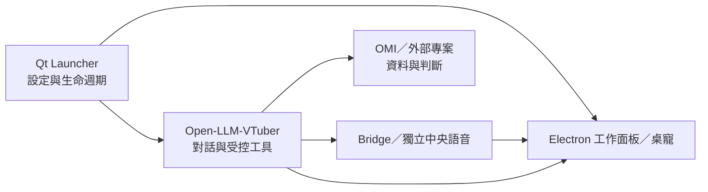

# Kuro

**Windows 上的 local-first 個人 AI 工作經理。**

Kuro 整合工作面板、Live2D 桌寵、Reader、Briefing、角色語音、受控工具與本機記憶，協助整理分散的工作資訊與下一步。角色與語音是互動介面；外部專案仍擁有自己的資料與專業判斷。

目前產品版本：**1.1.0**（以 [`VERSION`](VERSION) 為準）。為單一使用者的本機環境設計，目前不是一鍵安裝的通用產品。

*2026-08-24 實際 runtime 畫面，使用設定頁避開私人內容；非本次重新拍攝的版本驗收畫面。*

## 可以做什麼

| 需求 | 入口 |
| --- | --- |
| 對話、歷史與附件 | 工作面板與 Reader |
| 掃描當日來源狀態 | Today／行事曆／Briefing，保留來源限制 |
| 常駐短互動 | Live2D 桌寵、表情、動作與角色語音 |
| 使用外部工具與市場結果 | 受控工具；市場資料與判斷由 OMI 提供 |
| 管理角色與工作情境 | 設定、project packs 與記憶介面 |

長回答保留文字，spoken rendering 產生較短的角色語音。來源 stale、partial、missing 或失敗時，畫面與語音都必須保留限制。

*同日桌寵裁圖，未含桌面私人內容。更多入口見[功能導覽](docs/guides/feature-tour.md)。*

## 開始使用

本機環境已備妥時，執行根目錄 `桌寵啟動器.vbs`。工作面板先顯示，Qt Launcher 背景管理服務；再次執行可喚回面板，關閉面板通常只隱藏到 tray。

第一次使用請讀[開始使用](docs/guides/getting-started.md)。Git 不包含 Python 環境、模型、私人語音或憑證；中央語音需獨立準備。`00_kuro_bootstrap.ps1` 與 `compose.yaml` 是舊實驗，不是完整安裝入口。

## 如何協作

```mermaid
flowchart LR
    Launcher["Qt Launcher<br/>設定與生命週期"] --> Panel["Electron 工作面板／桌寵"]
    Launcher --> Runtime["Open-LLM-VTuber<br/>對話與受控工具"]
    Runtime --> Domain["OMI／外部專案<br/>資料與判斷"]
    Runtime --> Voice["Bridge／獨立中央語音"]
    Runtime --> Panel
    Voice --> Panel
```

Launcher 管啟動與診斷，conversation runtime 管對話與工具，Electron 管呈現。Kuro 不停止共用中央語音服務。設定、資料流與 API 見[現況架構](docs/architecture/RuntimeArchitecture.md)。

## 目前限制

- `kuro_core/` 仍是 shadow，未取代 Today／Briefing。完整工作管理依 [Roadmap](docs/product/Roadmap.md)逐項驗收。
- 工作面板特定操作已有原生確認；一般工具 `confirm` 模式目前會拒絕執行，不是完整確認佇列。
- 寫入、刪除、發送、發布、長期記憶修改與高成本操作遵守工具政策，不能因 persona 或 prompt 繞過。
- 中央語音仍有人工聽感與桌面互動待驗收，見[語音文件](docs/central-voice-runtime.md)。
- 尚無已驗證的完整新機安裝、跨元件一鍵備份或 Kuro 整體 CI；source checks 不等於產品驗收。
- 第三方素材與 bundled dependencies 尚未完成整包分發授權稽核，不能把根目錄授權套用到所有資產。

## 文件

- [文件入口](docs/index.md)：使用、維護與文件缺口。
- [開始使用](docs/guides/getting-started.md) · [功能導覽](docs/guides/feature-tour.md) · [故障排查](docs/guides/troubleshooting.md)。
- [開發指南](docs/guides/development.md) · [架構索引](docs/architecture/index.md)。
- [產品願景](docs/product/ProductVision.md) · [運作模型](docs/product/OperatingModel.md) · [品質門檻](docs/product/QualityBar.md) · [Roadmap](docs/product/Roadmap.md)。

## 公開政策與授權

[貢獻指南](CONTRIBUTING.md) · [行為準則](CODE_OF_CONDUCT.md) · [安全政策](SECURITY.md)

Kuro 自有程式與文字文件採 [Apache License 2.0](LICENSE)。上游 Open-LLM-VTuber、Cubism、角色、字型與其他素材保留各自條款，見 [第三方聲明](THIRD_PARTY_NOTICES.md) 與 [NOTICE](NOTICE)。
